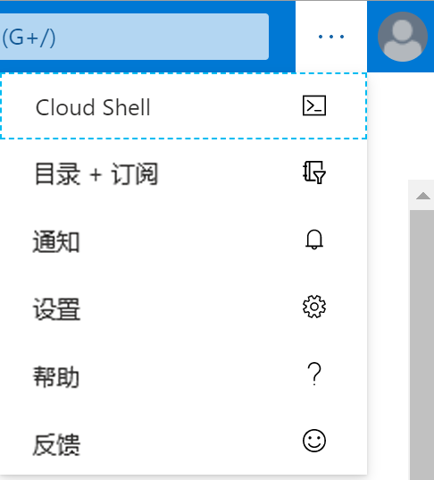
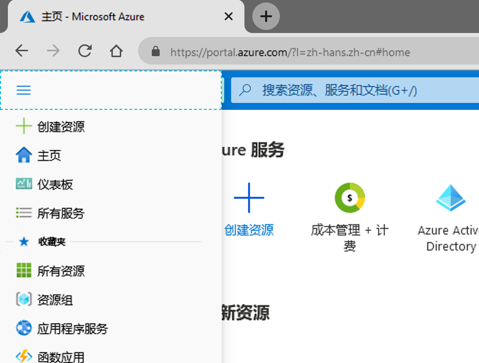
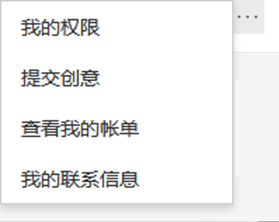
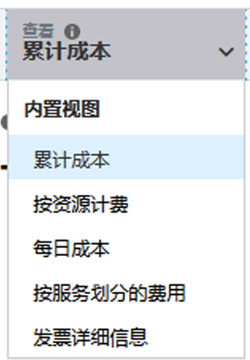

# 迷你实验室：使用 Azure 门户。

Azure 门户提供多种功能和服务；我们来看一下你通常使用的一些更常见领域。首先，花一点时间将鼠标指针悬停在顶部菜单栏中的每个图标上，并分别停留几秒钟。每个图标都应该有一个工具提示标签弹出窗口。此标签是菜单项的名称。稍后将使用这些图标。

在较窄的屏幕上，菜单可能不会出现，请选择省略号 (...) 按钮。

## 所有服务
你可以在 Azure 门户中找到几种服务。

1. 使用 Azure 帐户登录到 [Azure 门户](https://portal.azure.com)。

1. 在 Azure 门户的左上角选择 **“显示门户菜单”**。

     

1. 选择**所有服务**。 
    * 花几分钟时间查看 Azure 提供的服务列表。

1. 选择 **“虚拟机”**。（或者，使用视图左上角的搜索框）。

1. **“虚拟机”** 窗格出现。除非你先前创建了虚拟机，否则不会显示任何结果。

1. 选择 **“+ 添加”**。即会出现 **“创建虚拟机”** 窗格。

1. 选择右上角的 **“X”** 关闭 **“创建虚拟机”** 窗格。

1. 选择右上角的 **“X”** 关闭 **“虚拟机”** 窗格。

1. 选择左上角的 **“Microsoft Azure”** 返回主页。

## Azure Cloud Shell

Azure Cloud Shell 使你可以在 Azure 订阅中使用命令行接口 (CLI) 执行命令。可以通过选择工具栏中的图标来访问它。还可以导航到 https://shell.azure.com， 并在独立于门户的浏览器中启动 Cloud Shell。

创建的环境中包含各种管理和编程工具。

- Azure 命令行工具（Azure CLI、AzCopy 等）
- 语言/框架，包括 .NET Core、Python 和 Java
- 针对 Docker、Kubernetes 等的容器管理支持
- 代码编辑器，例如 vim、emacs、code 和 nano
- 生成工具（make、maven、npm 等）
- 数据库查询工具，例如 sqlcmd

使用 CLI：

1. 单击 Azure Cloud Shell 图标

1. 可以选择 **Bash** 或 **PowerShell** 环境，具体取决于个人喜好。任选一种 
    * 也可以随时通过 shell 左侧的语言下拉列表更改 shell。
1. 现在你已经访问了 Azure CLI
1. 写入
    > az version
1. CLI 以 JSON 格式返回有关 Cloud Shell CLI 版本的基本信息
1. 现在可以单击右上角的 **“X”** 将其关闭。

## 目录和订阅

1. 选择 **“目录+订阅”** （书和过滤器）图标来显示 **“目录+订阅”** 窗格。

  在这里可以在多个订阅或目录之间切换。如果将其他 Azure 目录绑定到同一电子邮件地址，则这些订阅也将可用。

  还有一个用于了解有关目录和订阅更多信息的链接。

2. 选择右上角的 **“X”**，关闭 **“目录 + 订阅”** 窗格。

## “通知”窗格

1. 在图标栏菜单栏上，选择 **“通知”** （钟形）图标。该窗口列出所有挂起的通知。

    

1. 如果出现任何通知，请将鼠标悬停在其中一个通知上。选择该通知中出现的 **“X”** 来将其关闭。

1. 选择 **“全部消除”**。现在应该没有任何通知显示。

1. 选择右上角的 **“X”** 以关闭 **“通知”** 窗格。

## 设置

1. 选择 **“设置”** （齿轮）图标来打开 **“门户设置”** 窗格，默认显示 **“常规”** 设置。

1. 展开 **“不活动时将我注销”** 设置。可在此选择一个便捷选项，例如选择无活动 **“一小时后”** 自动注销。

1. 在 **“选择主题”** 下，选择不同颜色的主题，并观察门户 UI 的变化。将其设置为你最喜欢的一种。

1. 在 **“高对比度主题”** 下，请尝试三个不同的选项。

1. 选择 **“启用弹出式通知”**。选中此选项后，通知将显示为“toast”风格的弹出式通知。并且仍将出现在通知（钟形）图标中。

1. 选择设置中的 **“语言和区域”** 选项卡。选择 **“语言”** 并选择 **“Español”**，然后选择 **“应用”** 按钮。如果出现 **“翻译此页面”** 对话框，则将其关闭。现在，整个门户都以西班牙语显示。

1. 要恢复为英文，请选择顶部菜单栏中**的设置**（齿轮）图标，然后切换到 **“Idioma y región”** 设置。选择 **“Idioma”**，然后选择 **“英语”**。选择 **“Aplicar”** 按钮。门户将重新以英语显示。

## “帮助”窗格

1. 选择**帮助** (?) 图标以显示 **“帮助”** 窗格。

1. 选择 **“帮助 + 支持”** 按钮。

>:heavy_check_mark: **注释：** 只能使用有效的付费订阅创建支持请求，因此，其中某些步骤可能与当前 UI 有所不同。

1. 在 **“帮助 + 支持”** 窗格中的 **“支持”** 下面，选择 **“新建支持请求。”** 若要新建支持请求，需要在以下各部分中填写信息：

    - **基本信息**：问题类型

    - **问题**：问题严重性、摘要和描述以及任何其他信息

    - **联系信息**：首选联系方式以及与此联系方式相关的信息

1. 选择 **“创建”** 以提出问题。

1. 可以通过选择 **“所有支持请求”** 来查看支持请求的状态。

### 新增功能和其他信息

1. 再次选择右上方的**帮助**图标，然后选择 **“新增功能”**。

1. 查看最近发布的功能。另请注意和探索其他 **“帮助”** 菜单选项，例如：
    - Azure 路线图
    - 启动指导教程
    - 键盘快捷键
    - 显示诊断
    - 隐私声明

1. 选择右上角的 **“X”**，关闭 **“新增功能”** 窗格。你现在应该会回到“仪表板”。

## “反馈”窗格

如果你在使用 Azure 的过程中有任何反馈或建议，可以执行以下操作：

1. 选择**反馈**（笑脸）图标打开 **“向我们发送反馈”** 窗格。

1. 在 **“告诉我们你的体验”** 中键入你对 Azure 的看法 

1. 选中 **“Microsoft 可针对你的反馈向你发送电子邮件”** 复选框

1. 选择 **“提交反馈”**。

1. **“反馈已发送”** 消息将出现，然后关闭。你现在应该会回到“仪表板”。

## 个人资料设置

1. 在门户的右上角选择你的姓名以显示个人资料信息：
    - 你的姓名
    - 你的电子邮件地址
    - “我的 Microsoft 帐户”链接
    - “切换目录”链接
    - 使用其他帐户登录，或完全退出
    - 椭圆按钮。单击查看更多选项
    
        

1. 选择“...”，然后选择 **“查看我的帐单”** 导航到 **“成本管理 + 计费 - 发票”** 页，该页可帮助分析 Azure 在何处产生成本。

1. 在左侧菜单上，前往 **“成本管理”** 

1. 在同一左侧菜单上的“成本管理”下，选择 **“成本分析”** 

1. 在显示的图表上方，单击 **“查看”** 

    

1. 从下拉菜单中选择 **“按服务划分的成本”**

>:heavy_check_mark: **注释：** 提供每项服务的成本详细信息。如果你是新帐户，或者仅使用免费服务。此页面可能为空

1. 选择右上角的 **“X”** 关闭 **“按服务划分的成本”** 窗格。

1. 选择右上角的 **“X”** 关闭 **“成本管理 + 计费 - 发票”** 页面并返回主页。
