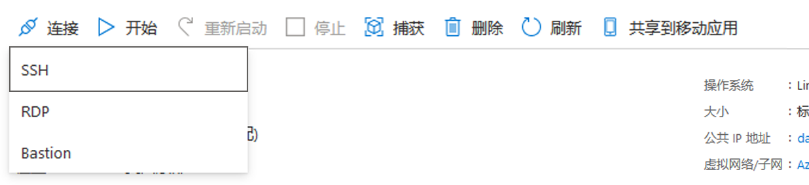

# 迷你实验室：Azure Cloud Shell 中的 Bash 的快速入门

本文详细介绍了如何在 Azure 门户的 Azure Cloud Shell 中使用 Bash。

## 启动 Cloud Shell

1. 使用 Azure 帐户登录到 [Azure 门户](https://portal.azure.com)。

1. 从 Azure 门户的顶部导航菜单启动 **“Cloud Shell”**。


1. 选择订阅以创建存储帐户和 Microsoft Azure 文件共享。

1. 选择 **“创建存储”**。

>:pencil: **提示:** 在每个会话中，你将会自动通过 Azure CLI 进行身份验证。

## 选择 Bash 环境

检查并确保 shell 窗口左侧的环境下拉列表显示 **“Bash”**。


## 设置你的订阅

1. 列出有权访问的订阅。

    ```
    az account list
    ```

1. 设置你的首选订阅：

    ```
    az account set --subscription 'my-subscription-name'
    ```
>:pencil: **提示：** 可使用 `/home/<user>/.azure/azureProfile.json` 记住订阅，以供日后会话使用。

## 创建资源组

在 WestUS 中创建名为“MyRG”的新资源组。

```
az group create --location westus --name MyRG
```

## 部署 Linux VM

在新资源组中创建 Ubuntu VM。Azure CLI 将创建 SSH 密钥并使用这些密钥设置 VM。

```
az vm create -n myVM -g MyRG --image UbuntuLTS --generate-ssh-keys
```

>:heavy_check_mark: **注意：** 使用 `generate-ssh-keys` 指示 Azure CLI 在 VM 和 `$ Home` 目录中创建和设置公钥和私钥。默认情况下，密钥放在 Cloud Shell 中的 `/home/<user>/.ssh/id_rsa` 和 `/home/<user>/.ssh/id_rsa.pub` 位置。`.ssh` 文件夹会保留在附加文件共享的用于保留 `$Home` 的 5 GB 映像中。

此 VM 上的用户名将是 Cloud Shell 中使用的用户名 ($User@Azure:)。

## SSH 到 Linux VM

1. 在 Azure 门户搜索栏中搜索 VM 名称。

1. 单击 **“连接”** 以获取 VM 名称和公共 IP 地址。

    

1. 使用 ssh cmd 以 SSH 到 VM。

    ```
    ssh username@ipaddress
    ```

建立 SSH 连接时，应该可以看到 Ubuntu 欢迎提示。


## 清理

1. 退出 SSH 会话。

    ```
    exit
    ```

1. 删除资源组以及其中的所有资源。

    ```
    az group delete -n MyRG
    ```
