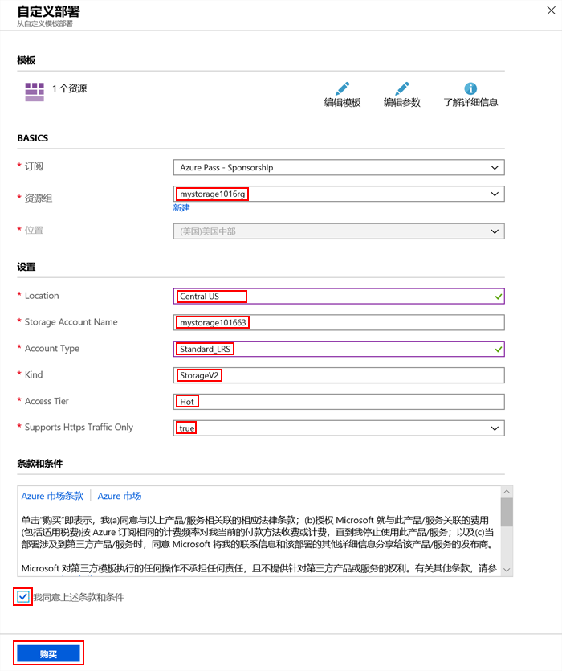

# 迷你实验室：通过使用 Azure 门户创建 ARM 模板

在本迷你实验室中，你将学习如何使用 Azure 门户创建、编辑和部署 Azure 资源管理器模板。此迷你实验室展示了如何创建 Azure 存储帐户，但是你可以使用相同的过程来创建其他 Azure 资源。

## 使用门户生成模板

使用 Azure 门户，可以配置资源，例如 Azure 存储帐户。在部署资源之前，可以将配置导出到资源管理器模板中。你可以保存模板，以后再使用。

1. 登录至 Azure 门户：https://portal.azure.com/。

2. 选择 **“创建资源”>“存储”>“存储帐户”**。

 3. 输入下列信息：

    * **资源组：** 选择 **“新建”**，然后指定你选择的资源组名称。 
    * **名称：** 为你的存储帐户指定一个唯一的名称。存储帐户名称必须在整个 Azure 中都是唯一的。如果收到错误消息提示“该存储帐户名已被占用”，可尝试使用 **\<你的名称\>存储\<以“月日”表示的当天日期\>**，例如 *mystorage1016*。
    
    * 可对剩余的属性使用默认值。**注意：** 有些导出的模板在部署之前需要进行编辑。

4. 选择屏幕底部的 **“查看 + 创建”**。

    ❗️**注意：**  ***请勿***选择下一步中的 **“创建”**。

5. 选择屏幕底部的 **“下载自动化模板”**。门户显示生成的模板：

    * 主窗格显示模板。这是一个包含六个顶级元素的 JSON 文件：`schema`、`contentVersion`、`parameters`、`variables`、`resources`和`output`。

    * 定义了六个参数。其中一个被称为 **“storageAccountName”**。在下一部分中，你将编辑模板以使用存储帐户的生成名称。

    * 在模板中，定义了一个 Azure 资源。类型是 `Microsoft.Storage/storageAccounts`。注意资源的定义方式和定义结构。
    
6. 在屏幕上方单击 **“下载”**。打开下载的 zip 文件，然后保存 **template.json** 到你的计算机。在下一部分中，你将使用模板部署工具来编辑模板。

7. 选择 **“参数”** 选项卡以查看你为参数提供的值。记下值。记下这些值，在部署模板时，在下一部分中将需要它们。

 
## 编辑和部署模板

Azure 门户可通过使用名为“模板部署”的门户工具来执行一些基本的*模板编辑*。要编辑更复杂的模板，请考虑使用 Visual Studio Code，它提供了更丰富的编辑功能。

Azure 要求每个 Azure 服务都具有唯一的名称。如果输入已存在的存储帐户名称，则部署失败。若要避免此问题，可以使用模板函数 `uniquestring()` 来生成唯一的存储帐户名称。

1. 在 Azure 门户中，选择 **“创建资源”**。

2. 在 **“搜索 Marketplace”** 中，键入 **“模板部署”**，然后按**ENTER**。

3. 选择 **“模板部署（使用自定义模板进行部署）”**。

4. 选择 **“创建”**。

5. 选择 **“生成自己的模板”** 以打开编辑器。

6. 选择 **“加载文件”**，然后选择上一节中下载的 *“template.json”* 文件。

7. 对模板进行以下三处更改：

    * 删除 `parameters` 元素中的 **“storageAccountName”** 参数。 
    * 向 `variables` 元素添加一个的名为 **“storageAccountName”** 的变量，如下所示：下面的示例将生成一个唯一的存储帐户名称：
        ```JSON
        "storageAccountName": "[concat(uniqueString(subscription().subscriptionId), 'storage')]"
        ```
    * 更新 **“Microsoft.Storage/storageAccounts”** 资源的名称元素，以使用新定义的变量而不是参数：
       ```json
       "name": "[variables('storageAccountName')]",
       ```   

8. 选择 **“保存”**。

9. 在所显示窗体的 **“基本”** 部分，选择上一节中创建的资源组。

10. 在窗体的 **“设置”** 部分，输入在上一节的步骤 8 中记下的参数值。这是示例部署的一张屏幕截图：

    

10. 接受条款和条件，然后选择 **“购买”**。

11. 从屏幕顶部选择响铃图标（通知）以查看部署状态。等待部署完成。

12. 从通知窗格中选择 **“转到资源组”**。你可以看到部署状态成功，并且资源组中只有一个存储帐户。存储帐户名称是模板生成的唯一字符串。 

## 清理资源

当不再需要 Azure 资源时，请通过删除资源组来清理部署的资源。
