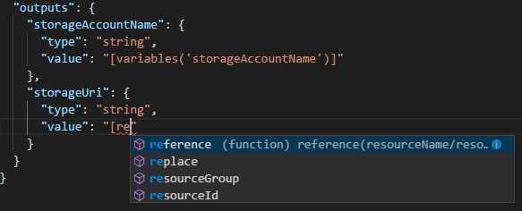

# 迷你实验室：使用 Visual Studio Code 创建 ARM 模板

在本小型实验室中，你将了解如何使用 Visual Studio Code 和 Azure 资源管理器工具扩展来创建和编辑 Azure 资源管理器模板。你可以在没有扩展的 Visual Studio Code 中创建资源管理器模板，但该扩展提供了可简化模板开发的自动完成选项。

一开始基于 [Azure 快速入门模板](https://azure.microsoft.com/resources/templates/)站点上提供的现有快速入门模板之一构建 ARM 模板通常更容易，也更好。

本迷你实验室基于[创建标准存储帐户](https://azure.microsoft.com/resources/templates/101-storage-account-create/)模板。

## 前提条件

你需要：

* Visual Studio Code。你可以在此处下载副本：[https://code.visualstudio.com/](https://code.visualstudio.com/)。
* 资源管理器工具扩展。

请按照下列步骤安装资源管理器工具扩展：

1. 打开 Visual Studio Code。
2. 按 **CTRL + SHIFT + X** 打开扩展窗格。
3. 搜索 **“Azure 资源管理器工具”**，然后选择 **“安装”**。
4. 选择 **“重新加载”**，完成扩展安装。

## 打开快速启动模板

1. 在 Visual Studio Code 中，选择 **“文件”>“打开文件”**。

2. 在 **“文件名”** 中，粘贴以下 URL：

    ```
    https://raw.githubusercontent.com/Azure/azure-quickstart-templates/master/101-storage-account-create/azuredeploy.json
    ```

3. 选择 **“打开”**，打开文件。

4. 选择 **“文件”>“另存为”** 将文件作为 *azuredeploy.json* 保存到本地计算机。

## 编辑模板

在输出部分中再添加一个元素，以显示存储 URI。

1. 在导出的模板中再添加一个输出：

    ```json
    "storageUri": {
        "type": "string",
        "value": "[reference(variables('storageAccountName')).primaryEndpoints.blob]"
    },
    ```

    完成后，输出部分如下所示：

    ```json
    "outputs": {
        "storageAccountName": {
            "type": "string",
            "value": "[variables('storageAccountName')]"
        },
        "storageUri": {
            "type": "string",
            "value": "[reference(variables('storageAccountName')).primaryEndpoints.blob]"
        }
    }
    ```

    在将代码复制并粘贴到 Visual Studio Code 时，可尝试重新键入 **value** 元素来体验资源管理器工具扩展的 IntelliSense 功能。

    

2. 选择 **“文件”>“保存”** 以保存文件。


## 部署模板

部署模板的方法有很多，你将使用 Azure Cloud Shell。 

1. 登录 [Azure Cloud shell](https://shell.azure.com/)。

2. 选择左上角的 **PowerShell** 环境。切换时需重启 shell。 

3. 选择 **“上传/下载”** 文件，然后选择 **“上传”**。

    

    选择你在上一节中保存的文件。默认名称为 **azuredeploy.json**。必须可从 shell 访问模板文件。可使用 **“ls”** 和 **“cat”** 命令来验证文件是否已上传成功。
    
4. 从 Cloud shell 中，运行以下命令。 

    ```powershell
    $resourceGroupName = Read-Host -Prompt "Enter the Resource Group name"
    $location = Read-Host -Prompt "Enter the location (i.e. centralus)"

    New-AzResourceGroup -Name $resourceGroupName -Location "$location"
    New-AzResourceGroupDeployment -ResourceGroupName $resourceGroupName -TemplateFile "$HOME/azuredeploy.json"
    ```

    如果将文件保存为 **azuredeploy.json** 以外的名称，请更新模板文件名称。

    以下屏幕截图显示了示例部署：

    

    屏幕截图中突出显示了存储帐户名称和输出部分中的存储 URL。 

## 清理资源

当不再需要 Azure 资源时，请通过删除资源组来清理部署的资源。

