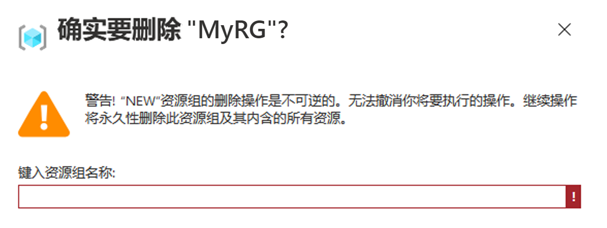

# 迷你实验室：使用 Visual Studio Code 创建 ARM 模板

**Azure 资源管理器 (ARM)** 是一项针对 Azure 的服务，它提供了一个管理层，使你能够创建、更新和删除 Azure 帐户中的资源。

在本迷你实验室中，你将了解如何使用 Visual Studio Code 和 Azure 资源管理器 (ARM) 工具扩展来创建和编辑 Azure 资源管理器模板。你可以在没有扩展的 Visual Studio Code 中创建资源管理器模板，但该扩展提供了可简化模板开发的自动完成选项。

一开始基于 [Azure 快速入门模板](https://azure.microsoft.com/resources/templates/)站点上提供的现有快速入门模板之一构建 ARM 模板通常更容易，也更好。

本迷你实验室基于[创建标准存储帐户](https://azure.microsoft.com/resources/templates/101-storage-account-create/)模板。

## 前提条件

你需要：

* Visual Studio Code。你可以在此处下载副本：[https://code.visualstudio.com/](https://code.visualstudio.com/)。
* 资源管理器工具扩展。

请按照下列步骤安装资源管理器工具扩展：

1. 打开 Visual Studio Code。
1. 按 **CTRL + SHIFT + X** 打开扩展窗格。
1. 搜索 **“Azure 资源管理器工具”**，然后选择 **“安装”**。
1. 选择 **“重新加载”**，完成扩展安装。

## 打开快速启动模板

1. 转到以下地址并复制文件内容

    ```
    https://raw.githubusercontent.com/Azure/azure-quickstart-templates/master/101-storage-account-create/azuredeploy.json
    ```


1. 从 Visual Studio Code 中，选择 **“文件”>“新建文件”**。

1. 将先前复制的代码粘贴到文件中

1. 选择 **“文件”>“另存为”** 以保存文件 

1. 将文件作为 *azuredeploy.json* 保存到本地计算机。


## 编辑模板

在输出部分中再添加一个元素，以显示存储 URI。

1. 将以下代码添加到 `azuredeploy.json` 的 **outputs** 属性

    ```json
    "storageUri": {
        "type": "string",
        "value": "[reference(variables('storageAccountName')).primaryEndpoints.blob]"
    },
    ```

    完成后，输出部分如下所示：

    ```json
    "outputs": {
        "storageAccountName": {
            "type": "string",
            "value": "[variables('storageAccountName')]"
        },
        "storageUri": {
            "type": "string",
            "value": "[reference(variables('storageAccountName')).primaryEndpoints.blob]"
        }
    }
    ```
    > **提示：**请注意，在`storageAccountName` 和我们刚刚添加的 `storageUri` 之间，有一个冒号 (`,`)！

    在将代码复制并粘贴到 Visual Studio Code 时，可尝试重新键入 **value** 元素来体验资源管理器工具扩展的 IntelliSense 功能。

    

1. 选择 **“文件”>“保存”** 以保存文件。


## 部署模板

部署模板的方法有很多，你将使用 Azure Cloud Shell。 

1. 登录 [Azure Cloud shell](https://shell.azure.com/)。

     * 如果系统提示 **“你没有装载存储”**，请保持默认选择，然后单击 **“创建存储”**（创建存储可能需要几秒钟）

1. 等待终端完成，它显示：
    `*YourName*@Azure:~$`

1. 选择左上角的 **PowerShell** 环境。 

1. 切换时需重启 shell。单击 **“确认”** 按钮

1. 等待终端完成，它显示：
    `PS /home/*YourName*>`

1. 选择**上传/下载文件**图标，然后选择 **“上传”**。

    

1. 选择你在上一节中保存的文件 (**azuredeploy.json**)。 

1. 确认显示在窗口的右下角
    * 要确认你的文件已成功上传，请运行以下命令
    
        `ls`
    * 如果控制台返回 **azuredeploy.json**（也许还有其他文件），则表明上传成功

    
1. 从 Cloud shell 中，运行以下命令。 

    ```powershell
    $resourceGroupName = Read-Host -Prompt "Enter the Resource Group name"
    ```
    * 此命令将要求你输入资源组的名称（例如“MyRS”）

    ```powershell
    $location = Read-Host -Prompt "Enter the location (i.e. centralus)"
    ```
    * 此命令将要求你输入资源组的位置（例如，westus、eastus 或 centralus）

    ```powershell
    New-AzResourceGroup -Name $resourceGroupName -Location "$location"
    ```
    * 此命令将显示你刚刚输入的配置

    ```powershell
    New-AzResourceGroupDeployment -ResourceGroupName $resourceGroupName -TemplateFile "$HOME/azuredeploy.json"
    ```
    * 此命令将基于先前提供的值创建一个新的 Azure `ResourceGroupDeployment`（这需要花费几秒钟）

        > 如果将文件保存为 **azuredeploy.json** 以外的名称，请更新模板文件名称。

    * 以下屏幕截图显示了示例部署：

        

    * 屏幕截图中突出显示了存储帐户名称和输出部分中的存储 URL。 

## 清理资源

当不再需要 Azure 资源时，请通过删除资源组来清理部署的资源。
1. 转到你的 Azure 帐户
1. 在顶部的搜索栏中，输入**资源组**，然后从 `服务` 中选择一个名为“资源组”的资源组
1. 找到刚刚创建的资源组的名称
1. 单击名称
1. 在顶部的选项中，单击 **“删除资源组”**

    

1. 系统会要求你**输入资源组名称**，以确认操作（这是窗口左上方 `主页` 下的名称）

    

1. 现在可以单击窗口底部的 **“删除”** 按钮

1. 等待通知面板指示资源已被删除

1. 完成了！

