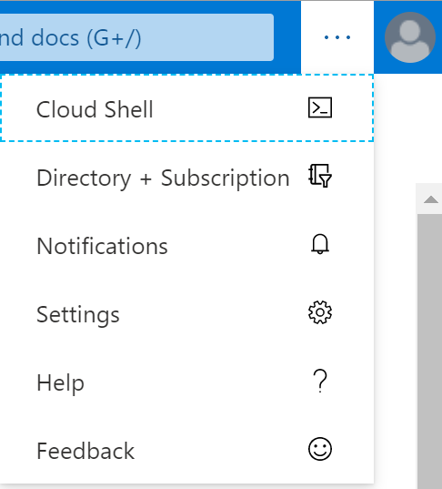
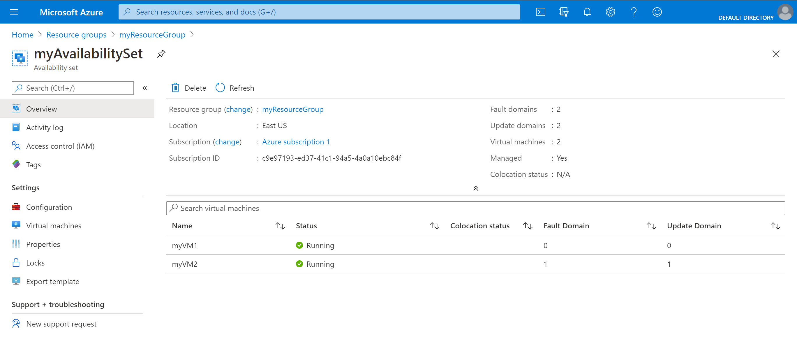

# 迷你实验室：在可用性集内创建 VM

## 前提条件

在此迷你实验室之前，需要预先设置环境变量 `AdminPassword`。要做到这一点，需要：

1. 从 Azure 门户的顶部导航启动 Cloud Shell

    

    * 如果较窄屏幕的顶部菜单栏上未显示该图标，请选择省略号 (...) 按钮。

        

    * 如果系统提示 **“你没有装载存储”**，请保持默认选择，然后单击 **“创建存储”**（创建存储可能需要几秒钟）

1. Cloud Shell 打开后，检查并确保 shell 窗口左侧的环境下拉列表显示 **“Bash”**。

    

    * 如果未显示“Bash”，单击并选择 `Bash`。确认

1. bash 就绪后，使用你自己的密码输入以下命令

    `
    AdminPassword="myStr0ngPW%%"
    `

    > 建议将 *myStr0ngPW%%* 更改为首选密码值，密码长度必须介于 12 到 72 个字符之间，且必须含有 1 个小写字符、1 个大写字符、1 个数字和 1 个特殊字符。 
    
1. 使用以下命令确认已设置了环境变量：

    `
    echo $AdminPassword
    `


## 创建可用性集

1. 要创建资源组，我们将运行以下命令： 

    `az group create --name myResourceGroup --location eastus`

1. 通过运行以下命令创建托管可用性集： 

    `az vm availability-set create --resource-group myResourceGroup --name myAvailabilitySet --platform-fault-domain-count 2 --platform-update-domain-count 2`
    * 这可能需要几秒钟时间

## 在可用性集内创建 VM

必须在可用性集中创建 VM，确保它们在硬件中正确分布。创建后，无法将现有 VM 添加到可用性集中。

> 通过 az vm create 创建 VM 时，请使用 --availability-set 参数指定可用性集的名称。

1. 通过运行以下命令创建两个虚拟机：

    ```
    for i in `seq 1 2`; do
    az vm create \
        --resource-group myResourceGroup \
        --name myVM$i \
        --availability-set myAvailabilitySet \
        --vnet-name MyVnet --subnet subnet1 \
        --image debian \
        --admin-password $AdminPassword \
        --admin-username azureuser \
        --no-wait
    done
    ```

1. 创建和配置这两个 VM 需要几分钟的时间。完成后，基础硬件中将分布有两个虚拟机。

1. 在窗口顶部的搜索栏中，输入 **“资源组”**，然后选择该名称的服务

1. 处于资源组视图上后，选择 **“myResourceGroup”**

1. 在 `myResourceGroup` 包含的资源中，选择 **“myAvailabilitySet”**

1. 查看 VM 在两个容错域和更新域中的分布方式。

    

## 清除部署

1. 运行以下命令来删除资源组、VM 和所有相关资源：`az group delete --name myResourceGroup --yes`

    * 这可能需要一段时间，请等待控制台完成操作
