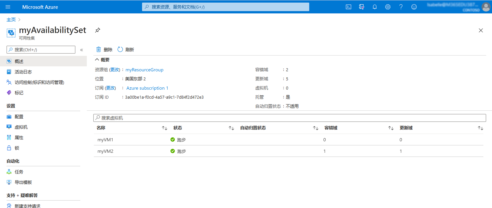

# 迷你实验室：在可用性集内创建 VM

## 前提条件

在进行此小型实验室之前，请确保满足以下先决条件：

- 事先设置环境变量： **AdminPassword="myStr0ngPW%%"**

## 创建可用性集

1. 从 Azure 门户的顶部导航启动 Cloud Shell

    

1. 检查并确保 shell 窗口左侧的环境下拉列表显示 **“Bash”**。

    

1. 通过运行以下命令创建资源组： `az group create --name myResourceGroup --location westus`

1. 通过运行以下命令创建托管可用性集： `az vm availability-set create --resource-group myResourceGroup --name myAvailabilitySet --platform-fault-domain-count 2 --platform-update-domain-count 2`

## 在可用性集内创建 VM

必须在可用性集中创建 VM，确保它们在硬件中正确分布。创建后，无法将现有 VM 添加到可用性集中。
通过 az vm create 创建 VM 时，请使用 --availability-set 参数指定可用性集的名称。

1. 通过运行以下命令创建两个虚拟机：

    ```
    for i in `seq 1 2`; do
    az vm create \
        --resource-group myResourceGroup \
        --name myVM$i \
        --availability-set myAvailabilitySet \
        --vnet-name MyVnet --subnet subnet1 \
        --image debian \
        --admin-password $AdminPassword \
        --admin-username azureuser \
        --no-wait
    done
    ```

1. 创建和配置这两个 VM 需要几分钟的时间。完成后，基础硬件中将分布有两个虚拟机。

1. 在 Azure 门户中，导航到 **“资源组”** > **“myResourceGroupAvailability”** > **“myAvailabilitySet”** 并查看可用性集。你应该会看到 VM 在两个容错域和更新域中的分布方式。

    

## 清除部署

1. 运行以下命令来删除资源组、VM 和所有相关资源： `az group delete --name myResourceGroup --yes`
