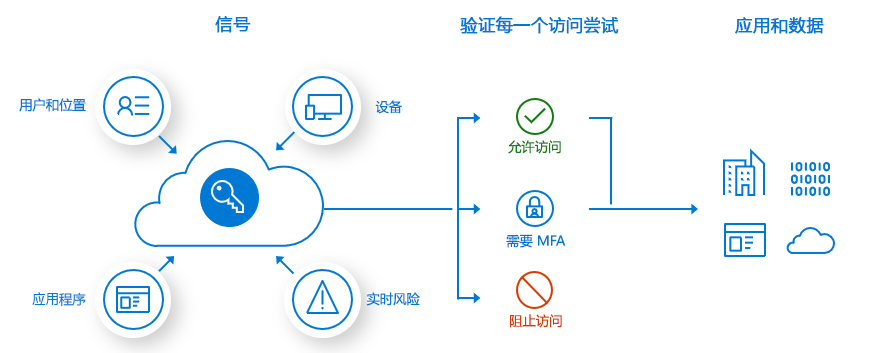
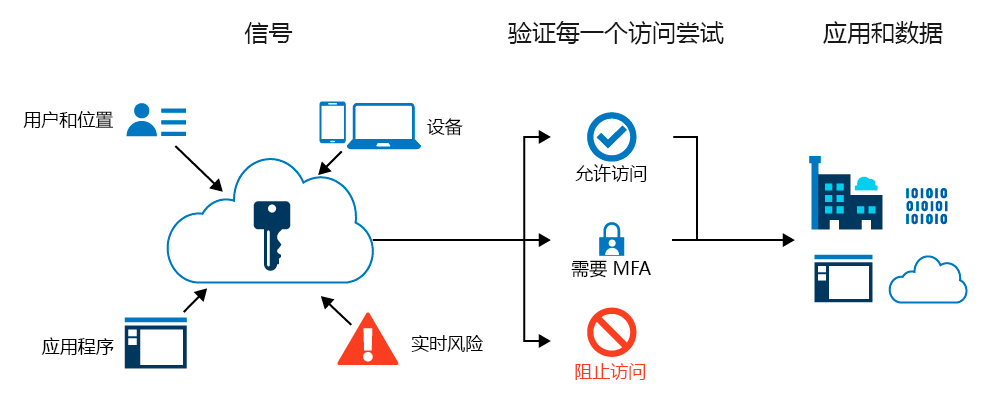
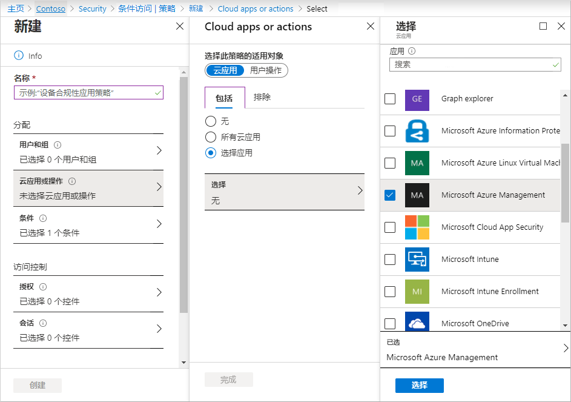
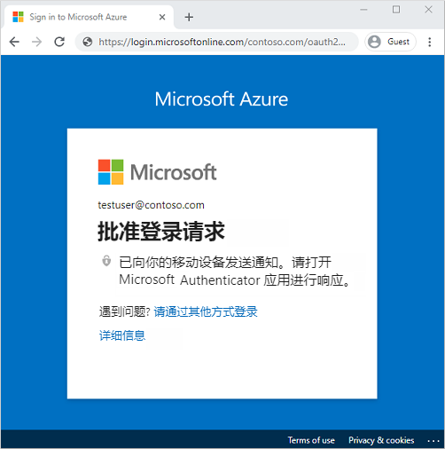

# 迷你实验室：使用 Azure 多重身份验证保护用户登录事件

多重身份验证 (MFA) 是在登录事件期间提示用户使用其他形式身份验证的过程。可能会提示用户在手机上输入密码或提供指纹扫描。要求第二种形式的身份验证可提高安全性，因为攻击者不容易获得或复制其他因素。

在特定的登录事件期间，可以通过 Azure 多重身份验证和条件访问策略来灵活地为用户启用 MFA。

**前提条件**

预计该实验室将作为**讲师演示**运行，因为要执行此迷你实验室，你需要以下资源和特权：

* 一个启用了 Azure AD Premium 或试用版许可证的有效 Azure AD 租户。 

* 一个拥有全局管理员权限的帐户。

* 具有知道密码的非管理员用户，例如 testuser。在此小型实验室中使用此帐户测试最终用户 Azure 多重身份验证体验。 

* 该非管理员用户所属的组，例如 MFA-Test-Group。在此小型实验室中为此组启用 Azure 多重身份验证。 

## 创建条件访问策略

建议通过条件访问策略来启用和使用 Azure 多重身份验证。借助条件访问，可以创建和定义对登录事件作出反应并请求其他操作的策略，然后再授予用户对应用程序或服务的访问权限。

此小型实验室将创建一个基本的条件访问策略，用于在用户登录 Azure 门户时提示进行 MFA。 

首先，按如下所述创建一个条件访问策略，并分配测试用户组：

1. 使用具有全局管理员权限的帐户登录至 [Azure 门户](https://portal.azure.com/)。

1. 搜索并选择 **“Azure Active Directory”**，然后选择左侧菜单中的 **“安全性”**

1. 选择 **“条件访问”**，同样选择左侧菜单中的 **“+ 新建策略”**。

1. 输入策略名称，例如 *“MFA 试点”*。

1. 在 **“分配”** 下选择 **“用户和组”**，然后选中 **“选择用户和组”**。

1. 选中 **“用户和组”** 复选框， 然后选择 **“选择”**。

1. 浏览并选择 Azure AD 组（例如 *MFA-Test-Group*），然后选择 **“选择”**。

    

1. 要对该组应用条件访问策略，请选择 **“完成”**。

## 配置多重身份验证的条件

创建条件访问策略并分配测试用户组后，现在可以定义触发该策略的云应用或操作。这些云应用或操作是确定需要进一步处理的方案，例如提示执行 MFA。 

将条件访问策略配置为在用户登录到 Azure 门户时要求执行 MFA。

1. 选择 **“云应用或操作”**。可选择将条件访问策略应用到所有云应用**或选定应用**。

1. 在 **“包含”** 页面上，选择 **“选择应用”**。

1. 选择 **“选择”**，然后浏览可用的登录事件列表。

1. 选择 **“Microsoft Azure 管理”**，将策略应用于 Azure 门户的登录事件。

1. 要应用选定应用，请选择 **“选择”**，然后选择 **“完成”**。

    

1. 使用访问控制可以定义授予用户访问权限所要满足的要求，例如需要一个已批准的客户端应用，或使用已加入混合 Azure AD 的设备。将访问控制配置为在 Azure 门户登录事件期间要求执行 MFA。

1. 在 **“访问控制”** 下选择 **“授予”**，并确保 **“授予访问权限”** 已选中。

1. 选中 **“需要多重身份验证”** 复选框，然后选择 **“选择”**。

    如果想查看配置如何影响用户，可将“条件访问”策略设置为“仅报告”；如果此时不想使用策略，可以设置为“关”。因为该演示针对的是一组测试用户，所以我们启用策略，然后测试 Azure 多重身份验证。

1. 将 *“启用策略”* 设置为 **“开启”**。

1. 要应*用条件访问策略*，请选择 **“创建”**。

## 测试 Azure 多重身份验证

若要查看条件访问策略和 Azure 多重身份验证，请按以下步骤登录到不需要 MFA 的资源：

1. 在 InPrivate 模式或隐身模式下打开新的浏览器窗口，然后浏览到 [https://account.activedirectory.windowsazure.com](https://account.activedirectory.windowsazure.com/)。

1. 使用非管理员测试用户（例如 testuser）登录。系统不会提示完成 MFA。

1. 关闭浏览器窗口。

    现在登录至 Azure 门户。由于在条件访问策略中将 Azure 门户配置为需要附加验证，因此你将收到 Azure 多重身份验证提示。

1. 在 InPrivate 模式或匿名模式下打开新的浏览器窗口，然后浏览至 [https://portal.azure.com](https://portal.azure.com/)

1. 使用非管理员测试用户（例如 testuser）登录。你需要注册并使用 Azure 多重身份验证。按照提示完成流程，并确认已成功登录到 Azure 门户。

    
