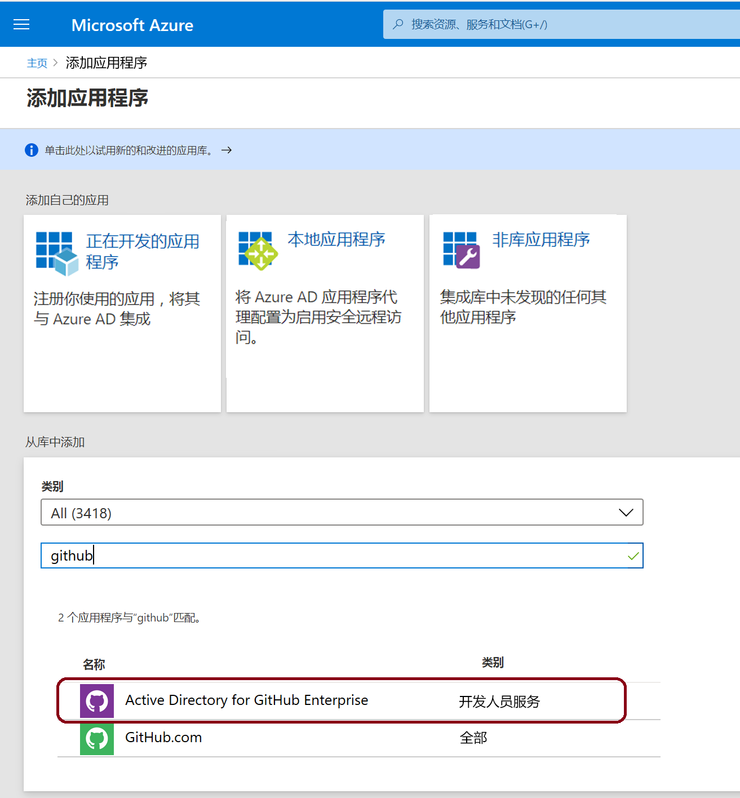

# 迷你实验室：在 Azure AD 门户中向 Azure AD 添加来宾用户

你可以将任何人以来宾用户身份添加到你的目录中，邀请其与你的组织进行协作。然后，你可以发送包含兑换链接的邀请电子邮件，也可以将直接链接发送到要共享的应用。 

来宾用户可以使用其工作标识、学校标识或社交标识登录。

在此小型实验室中，将向 Azure AD 添加新的来宾用户并发送邀请。

## 前提条件

要完成此小型实验室的方案，你需要：

* 可以在租户目录中创建用户的角色，例如“全局管理员”角色或任何受限的管理员目录角色。

* 可以添加到租户目录并用于接收测试邀请电子邮件的有效电子邮件帐户。

## 将来宾用户添加到 Azure AD

1. 以 Azure AD 管理员身份登录到 [Azure 门户](https://portal.azure.com/)。

1. 在左窗格中，选择 **“Azure Active Directory”**。

1. 在左侧的 **“管理”** 左窗格中，选择 **“用户”**。

    

1. 在顶部栏中选择 **“新来宾用户”**

    

1. 在 **“新建用户”** 页面上，选择 **“邀请用户”**，然后添加来宾用户的信息。

    

    - ***标识***
        - **名称：**来宾用户的名字和姓氏。

        - **电子邮件地址（必填项）：**来宾用户的电子邮件地址。

    - ***个人消息（可选）：***  包含发送给来宾用户的个人欢迎消息。

    - ***组和角色*** 
    
        - **组：**可以将来宾用户添加到一个或多个现有组中，也可以稍后添加。

        - **目录角色：**如果需要用户的 Azure AD 管理权限，则可以将其添加到 Azure AD 角色。
    - ***设置***
        - **阻止登录（可选）：**允许你阻止用户登录而不删除个人资料 
        - **使用位置（可选）：**该用户的实际位置
    - ***作业信息***
        - **作业总览（可选）**
        - **部门（可选）**

1. 选择 **“邀请”**，以自动向来宾用户发送邀请。通知将显示在右上方，并显示消息“成功邀请用户”。

1. 发送邀请后，该用户帐户将以来宾身份自动添加到目录。

## 将应用分配给来宾用户

将用于 GitHub Enterprise 的 Active Directory** 应用添加到测试租户，然后将测试来宾用户分配给该应用。

1. 以 Azure AD 管理员的身份登录 Azure 门户。

1. 在左侧窗格中，选择 **“企业应用程序”**。
    - 或者，你可以在页面顶部的搜索框中进行搜索

1. 选择 **“新建应用程序”**。

    

1. 在 **“从库中添加”** 下，搜索 **“GitHub”**，然后选择 **“GitHub Enterprise 的 Active Directory”**。

    

1. 选择 **“添加”** 或“创建”。它将显示一个新窗口

    

1. 在“管理”左窗格下选择 **“单一登录”**，并在 **“单一登录模式”** 下选择 **“基于密码的登录”**，然后单击 **“保存”**。

1. 在 **“管理”** 左窗格中，选择 **“用户和组”>“添加用户”**

1.  请单击 **“用户”**，将出现一个右窗格，单击要添加的用户，然后单击“用户”，单击 **“选择”**。

    

1. 选择 **“分配”**。

## 接受来宾用户邀请

现在登录到来宾用户电子邮件帐户，以查看邀请。

1. 登录测试来宾用户的电子邮件帐户。

1. 在收件箱中，找到“你已受到邀请”电子邮件。

1. 在电子邮件正文中，选择“开始”。将在浏览器中打开“查看权限”页面。

1. 选择 **“接受邀请”**。将打开访问面板，其中列出了来宾用户可以访问的应用程序。

    
