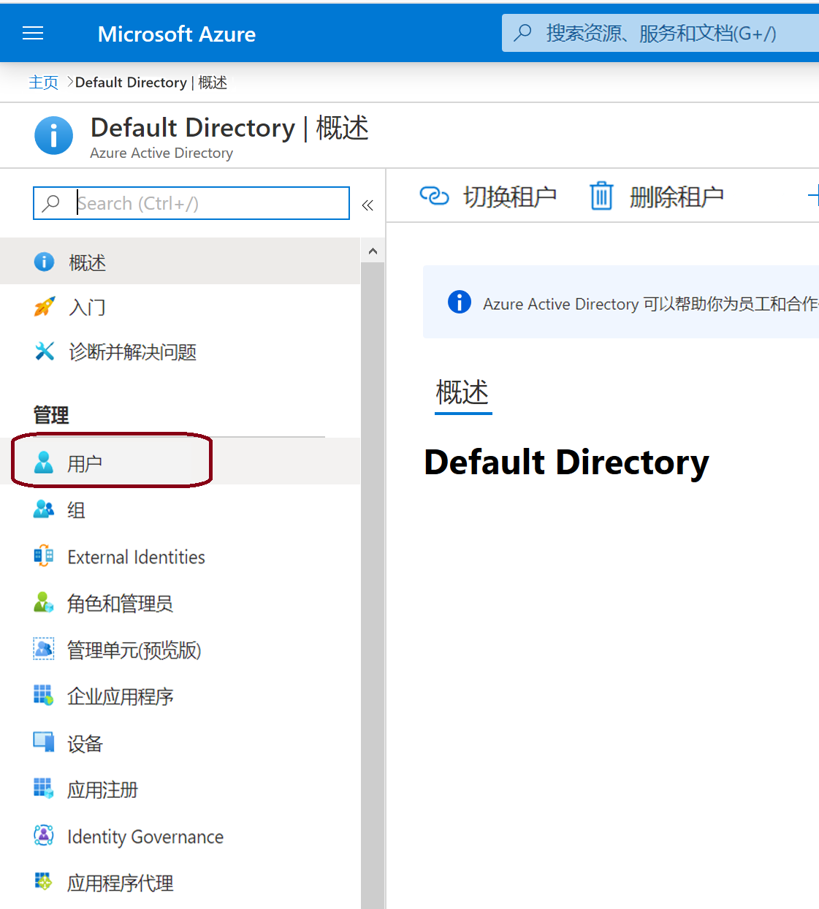
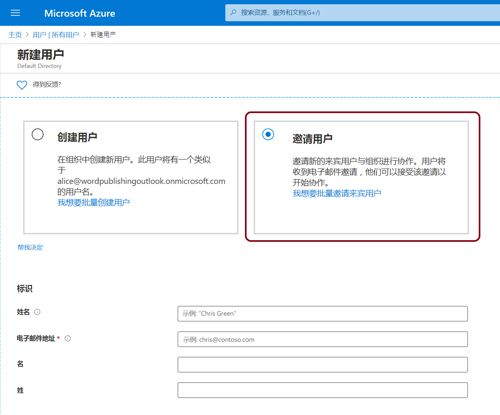
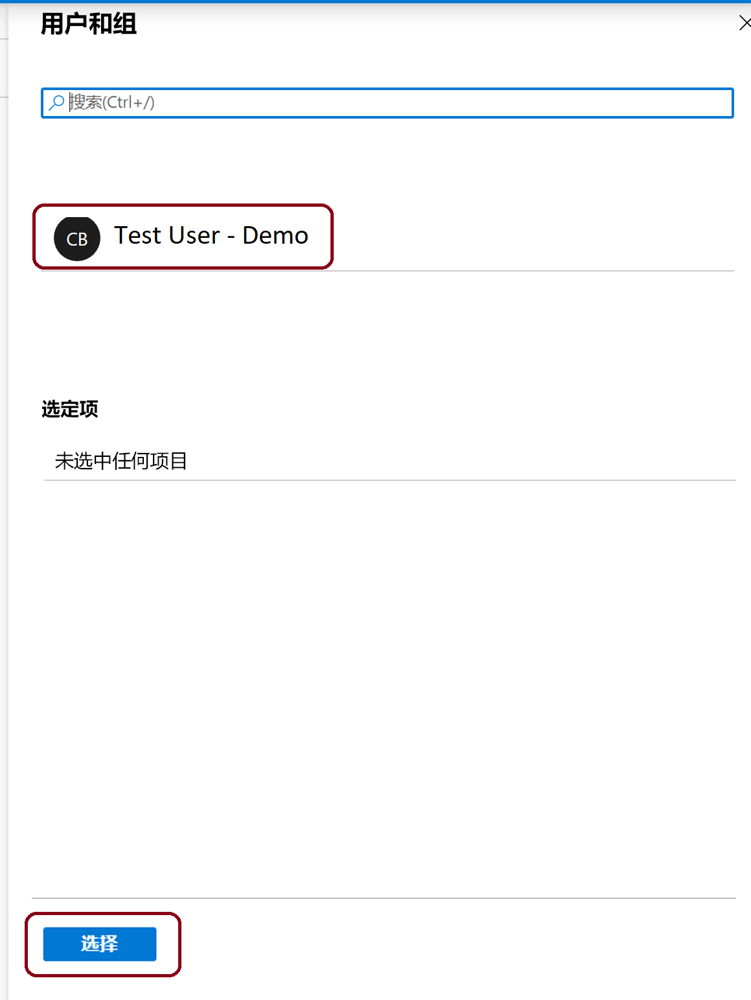

# 迷你实验室：在 Azure 门户中将来宾用户添加到 Azure AD

通过将人员作为来宾用户添加到目录中，可邀请任何人与你的组织进行协作。然后，可发送包含兑换链接的邀请电子邮件，也可发送要共享的应用的直接链接。 

来宾用户可以使用自己的工作、学校或社交身份登录。

在此迷你实验室中，将向 Azure AD 添加新的来宾用户并发送邀请。

## 前提条件

要完成此迷你实验室的方案，你需要：

* 一个角色，可让你在租户目录中创建用户，例如全局管理员角色或任何受限的管理员目录角色。

* 一个有效的电子邮件帐户，你可以添加到租户目录中，并可以用来接收测试邀请电子邮件。

## 将来宾用户添加到 Azure AD

1. 以 Azure AD 管理员身份登录到 [Azure 门户](https://portal.azure.com/)。

2. 在左窗格中，选择 **“Azure Active Directory”**。

3. 在 **“管理”** 下，选择 **“用户”**。

    

4. 选择 **“新建来宾用户”**。

    

5. 在 **“新建用户”** 页面上，选择 **“邀请用户”** 添加来宾用户信息。

    

    - **姓名** 来宾用户的名字和姓氏。

    - **电子邮件地址（必填）** 来宾用户的电子邮件地址。

    - **个人消息（可选）** 包含发送给来宾用户的个人欢迎消息。

    - **组** 可以将来宾用户添加到一个或多个现有组中，也可以稍后进行。

    - **目录角色** 如果需要用户的 Azure AD 管理权限，可以将其添加到 Azure AD 角色。

6. 选择 **“邀请”**，以自动向来宾用户发送邀请。一条通知出现在右上方，并显示消息“成功邀请用户”。

7. 发送邀请后，该用户帐户将以来宾的形式自动添加到目录。

## 将应用分配给来宾用户

将 *Active Directory for GitHub Enterprise* 应用添加到测试租户，并将测试来宾用户分配给该应用。

1. 以 Azure AD 管理员身份登录到 Azure 门户。

2. 在左窗格中，选择 **“企业应用程序”**。

3. 选择 **“新建应用程序”**。

    

4. 在 **“从库中添加”** 下，搜索 **“GitHub”**，然后选择 **“Active Directory for GitHub Enterprise”**。

    

5. 选择 **“添加”**。

6. 在“管理”下选择 **“单一登入”**，在 **“单一登录模式”** 下选择 **“基于密码的登录”**，然后单击 **“添加”**。

    

7. 在 **“管理”** 下，选择 **“用户和组” > “添加用户” > “用户和组”**，单击 **“选择”**。

    

8. 选择 **“分配”**。

## 接受来宾用户邀请

现在登录到来宾用户电子邮件帐户以查看邀请。

1. 登录到测试来宾用户的电子邮件帐户。

2. 在收件箱中，找到 “*你已被邀请*” 电子邮件。

3. 在电子邮件正文中，选择“入门”。“审阅权限”页面在浏览器中打开。

4. 选择 **“接受邀请”**。访问面板打开，其中列出来宾用户可以访问的应用程序。

    
