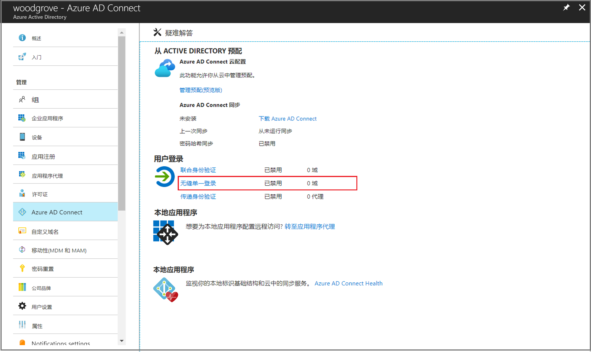

# 迷你实验室：Azure Active Directory 无缝单一登录

 

当用户位于连接到公司网络的公司桌面上时，Azure Active Directory (Azure AD) 无缝单一登录 (无缝 SSO) 会自动对其进行登录。无缝 SSO 使用户可以轻松访问基于云的应用程序，而无需任何其他本地组件。

## 前提条件

在进行此小型实验室之前，请确保满足以下先决条件：

* **设置 Azure AD Connect 服务器**： 如果使用传递身份验证作为登录方法，则无需进行其他先决条件检查。如果使用密码哈希同步作为登录方法，并且 Azure AD Connect 和 Azure AD 之间存在防火墙，请确保：

	* 使用版本 1.1.644.0 或更高版本的 Azure AD Connect。
	
	* 如果防火墙或代理允许 DNS 白名单，请将通过端口 443 与 *.msappproxy.net URL 的连接列入白名单。 

* **设置域管理员凭据**： 需要具有以下每个 Active Directory 林的域管理员凭据：

	* 通过 Azure AD Connect 同步到 Azure AD。
	
	* 包含要为他们启用无缝 SSO 的用户。

## 启用 Azure AD Connect

通过 [Azure AD Connect](https://docs.microsoft.com/zh-cn/azure/active-directory/hybrid/whatis-hybrid-identity) 启用无缝 SSO 。

如果要全新安装 Azure AD Connect，请选择 [“自定义安装路径”](https://docs.microsoft.com/zh-cn/azure/active-directory/hybrid/how-to-connect-install-custom)。在 **“用户登录”** 页面，选中 **“启用单一登录选项”**。

如果已经安装了 Azure AD Connect，请选择 Azure AD Connect 中的 **“更改用户登录”** 页面，然后选择 **“下一步”**。

继续执行向导，直到进入 **“启用单一登录”** 页面。为以下每个 Active Directory 林提供域管理员凭据：

* 通过 Azure AD Connect 同步到 Azure AD。

* 包含要为他们启用无缝 SSO 的用户。

完成向导后，将在租户上启用无缝 SSO。

## 验证是否已启用无缝 SSO

请按照以下流程验证是否正确启用了无缝 SSO：

1.使用租户的全局管理员凭据登录到 [Azure Active Directory 管理中心](https://aad.portal.azure.com/)。

2. 在左侧窗格中选择 **“Azure Active Directory”**。

3. 选择 **“Azure AD Connect”**。

4. 验证无缝单一登录功能是否显示为 *“已启用”*。

>重要提示

无缝 SSO 在每个 AD 林中的本地 Active Directory (AD) 中创建一个名为 AZUREADSSOACC 的计算机帐户。出于安全原因，需要对 AZUREADSSOACC 计算机帐户进行严格保护。只有域管理员才能管理计算机帐户。确保计算机帐户上的 Kerberos 委派已禁用，并且 Active Directory 中没有其他帐户对 AZUREADSSOACC 计算机帐户有委派权限。将计算机帐户存储在组织单位 (OU) 中，可以防止意外删除，并且只有域管理员才可以访问。
