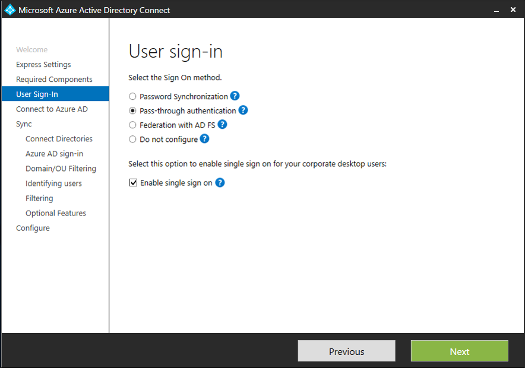

# 迷你实验室：Azure Active Directory 无缝单一登录

 

当用户使用连接到企业网络的企业台式机时，Azure Active Directory (Azure AD) 无缝单一登录（无缝 SSO）会自动登录这些用户。无缝 SSO 可让用户轻松访问基于云的应用程序，而无需使用其他任何本地组件。

## 前提条件

预计该实验室将作为**讲师演示**运行，因为在使用此小型实验室之前需要具备以下先决条件：

* **设置 Azure AD Connect 服务器**：如果使用直通身份验证作为登录方法，则无需进行其他先决条件检查。如果使用密码哈希同步作为登录方法，并且 Azure AD Connect 和 Azure AD 之间存在防火墙，请确保：

	* 使用 Azure AD Connect 版本 1.1.644.0 或更高版本。
	
	* 如果防火墙或代理允许 DNS 允许列表，请允许端口 443 上指向 *.msappproxy.net URL 的连接。 

* **设置域管理员凭据**：你需要为满足以下条件的每个 Active Directory 林提供域管理员凭据：

	* 通过 Azure AD Connect 同步到 Azure AD。
	
	* 包含你想要为其启用无缝 SSO 的用户。

## 启用 Azure AD Connect

1. 通过 [Azure AD Connect](https://docs.microsoft.com/zh-cn/azure/active-directory/hybrid/whatis-hybrid-identity) 启用无缝 SSO。

	* 如果你要全新安装 Azure AD Connect，请选择[自定义安装路径](https://docs.microsoft.com/zh-cn/azure/active-directory/hybrid/how-to-connect-install-custom)。在 **“用户登录”** 页面，选中 **“启用单一登录选项”**。

		

	* 如果已经安装了 Azure AD Connect，请选择 Azure AD Connect 中的 **“更改用户登录”** 页面，然后选择 **“下一步”**。

		

1. 继续执行向导，直到进入 **“启用单一登录”** 页面。为满足以下条件的每个 Active Directory 林提供域管理员凭据：

	* 通过 Azure AD Connect 同步到 Azure AD。

	* 包含你想要为其启用无缝 SSO 的用户。

1. 完成向导后，租户即启用了无缝 SSO。

## 验证无缝 SSO 是否已启用

请按照以下步骤验证你是否正确启用了无缝 SSO：

1. 使用租户的全局管理员凭据登录到 [Azure Active Directory 管理中心](https://aad.portal.azure.com/)。

1. 在左窗格中选择 **“Azure Active Directory”**。

1. 选择 **“Azure AD Connect”**。

1. 验证无缝单一登录功能是否显示为 *“已启用”*。

	

>重要

无缝 SSO 在每个 AD 林中的本地 Active Directory (AD) 中创建名为 AZUREADSSOACC 的计算机帐户。出于安全原因，需要对 AZUREADSSOACC 计算机帐户进行严格保护。只有域管理员才能管理该计算机帐户。确保计算机帐户上的 Kerberos 委派已禁用，并且 Active Directory 中没有其他帐户对 AZUREADSSOACC 计算机帐户有委派权限。将计算机帐户存储在能够免于意外删除并且只有域管理员才有权访问的组织单位 (OU) 中。
