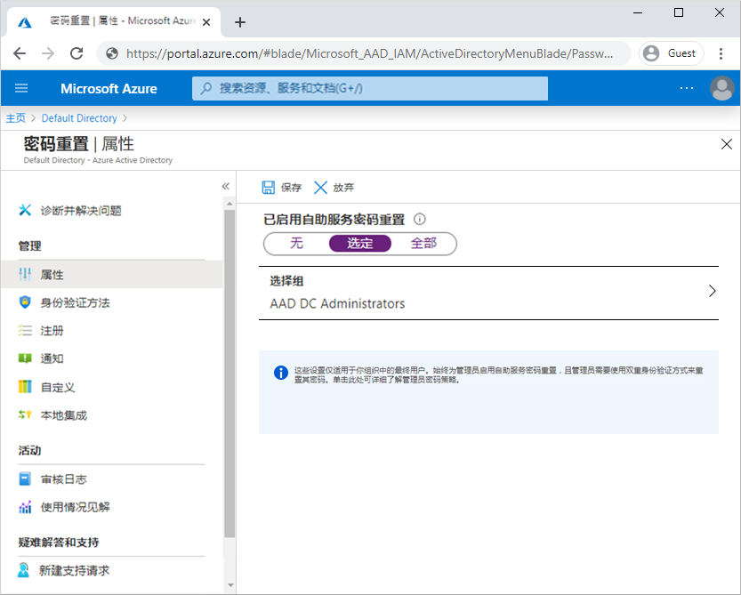

# 迷你实验室：启用 Azure AD 自助式服务密码重置

Azure Active Directory（Azure AD）自助式密码重置 (SSPR) 使用户无需管理员或帮助台即可更改或重置密码。如果用户的帐户被锁定或忘记了密码，则可以按照提示解除阻止并重新开始工作。当用户无法登录其设备或应用程序时，此功能可减少技术支持呼叫和工作效率损失。

本主题演示如何启用自助式密码重置。 

* 为一组 Azure AD 用户启用自助式密码重置

* 配置身份验证方法和注册选项

* 以用户身份测试 SSPR 流程

## 前提条件

若要完成此微型实验室，你需要以下资源和特权：

* 至少启用了试用许可证的有效 Azure AD 租户。 

* 具有全局管理员特权的帐户。

* 具有已知密码的非管理员用户，例如 testuser。可以在此迷你实验室中使用此帐户测试最终用户的 SSPR 体验。 

* 非管理员用户构成的组，例如 SSPR-Test-Group。你可以在本小型实验室中为此组启用 SSPR。 

## 启用自助式密码重置

Azure AD 使你可以为“无”、“选定”或“所有”用户启用 SSPR。这种细粒度的功能使你可以选择一部分用户来测试 SSPR 注册过程和工作流。当你对流程感到满意并可以与更广泛的用户交流需求时，可以选择其他用户组以启用 SSPR。或者，你可以为 Azure AD 租户中的每个人启用 SSPR。

在本迷你实验室中，为测试组中的一组用户配置 SSPR。在以下示例中，使用组 SSPR-Test-Group。根据需要提供自己的 Azure AD 组：

1. 使用拥有全局管理员权限的帐户登录到 [Azure 门户](https://portal.azure.com/)。

2. 搜索并选择 **“Azure Active Directory”**，然后从左侧菜单中选择 **“密码重置”**。

3. 在 **“属性”** 页面上，在“已启用的自助式密码重置”选项下，选择 **“选择组”**。

4. 浏览并选择你的 Azure AD 组，例如 *SSPR-Test-Group*，然后选择 **“选择”**。

    

    在更广泛的 SSPR 部署中，支持嵌套组。确保你选择的组中的用户分配了适当的许可证。这些许可要求目前没有验证过程。

5. 要为所选用户启用 SSPR，请选择 **“保存”**。

## 选择身份验证方法和注册选项

当用户需要解锁帐户或重置密码时，系统会提示他们选择其他确认方法。此附加身份验证因素可确保仅完成批准的 SSPR 事件。你可以根据用户提供的注册信息选择允许使用的身份验证方法。

1. 在左侧菜单的 **“身份验证方法”** 页面，将 **“重置所需的方法数”** 设置为 *“1”*。

    为了提高安全性，可以增加 SSPR 所需的身份验证方法的数量。

2. 选择你的组织希望允许的 **“用户可用的方法”**。对于迷你实验室，请选中相应的框以启用以下方法：

    - *移动应用通知*

    - *移动应用编码*

    - *电子邮件*

    - *移动电话*

    - *办公电话*

3. 要应用身份验证方法，请选择 **“保存”**。

    用户必须先注册其联系信息，然后才能解锁其帐户或重置密码。此联系信息用于前面步骤中配置的不同身份验证方法。

    管理员可以手动提供此联系信息，或者用户可以转到注册门户自行提供该信息。在此迷你实验室中，配置用户下次登录时提示其进行注册。

1. 在左侧菜单的 **“注册”** 页面上，对 **“要求用户在登录时注册”** 选择“是”。

2. 重要的是保持联系信息是最新的。如果在启动 SSPR 事件时联系信息已过时，则用户可能无法解锁其帐户或重置其密码。

1. 将 **“要求用户重新确认其身份验证信息前的天数”** 设置为 *“180”*。

3. 要应用注册设置，请选择 **“保存”**。

## 配置通知和自定义

为了使用户了解帐户活动，你可以配置为在 SSPR 事件发生时发送电子邮件通知。这些通知可以涵盖普通用户帐户和管理员帐户。对于管理员帐户，当使用 SSPR 重设特权管理员帐户密码时，此通知可提供另一层意识。

1. 在左侧菜单的 **“通知”** 页面上，配置以下选项：

    - 将 **“在密码重置时通知用户”选项** 设置为 *“是”*。

    - 将 **“当其他管理员重置密码时通知所有管理员”** 设置为 *“是”*。

2. 要应用通知首选项，请选择 **“保存”**。

## 测试自助式密码重置

在启用和配置 SSPR 的情况下，请使用在上一节中所选择组的一部分用户（例如 Test-SSPR-Group）测试 SSPR 进程。在下面的示例中，使用 testuser 帐户。提供你自己的用户帐户，该帐户属于你在此迷你实验室的第一部分为 SSPR 启用的组。

>**注意**
在测试自助服务密码重置时，请使用非管理员帐户。始终为管理员启用自助式密码重置功能，并且要求管理员使用两种身份验证方法重置其密码。

1. 要查看手动注册过程，请在 InPrivate 或隐身模式下打开一个新的浏览器窗口，然后浏览至 [https://aka.ms/ssprsetup](https://aka.ms/ssprsetup)。下次登录时，应将用户定向到此注册门户。

2. 使用非管理员测试用户（例如 testuser）登录，并注册身份验证方法的联系信息。

3. 完成后，选择 **“看上去不错”** 按钮并关闭浏览器窗口。

4. 在 InPrivate 或隐身模式下打开一个新的浏览器窗口，然后浏览至 [https://aka.ms/sspr](https://aka.ms/sspr)。

5. 输入你的非管理员测试用户的帐户信息，例如 testuser、CAPTCHA 中的字符，然后选择 **“下一步”**。

    

6. 请按照验证步骤重设密码。完成后，你应该收到一封电子邮件通知，告知你密码已重置。
