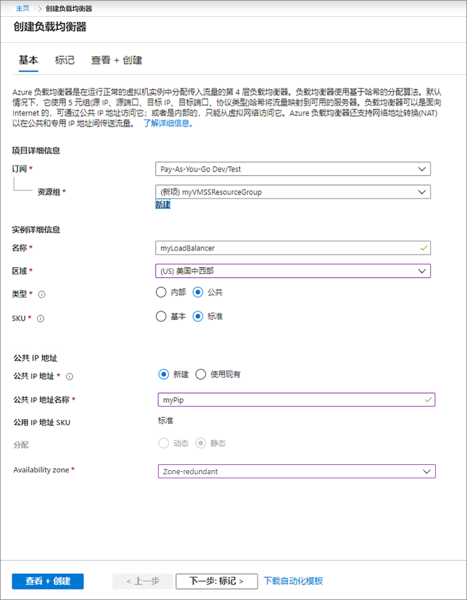
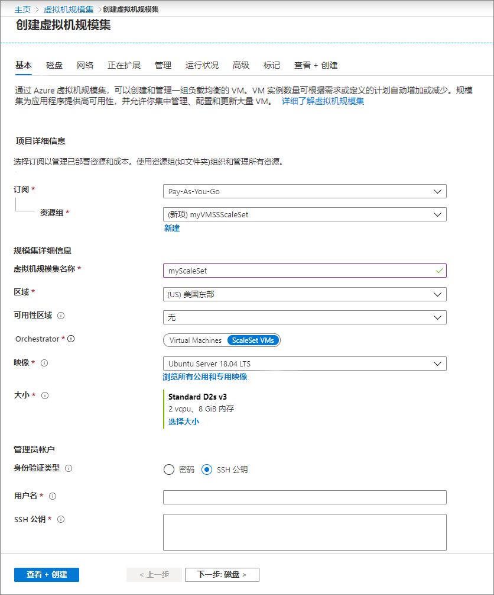

# 迷你实验室：在 Azure 门户中创建 VM 规模集

## 创建公共负载均衡器

使用门户创建公共负载均衡器。创建的名称和公共 IP 地址将自动配置为负载均衡器的前端。

1. 在搜索框中，键入 *“负载均衡器”*。在搜索结果的 **“市场”** 下，选择 **“负载均衡器”**。

2. 在“创建负载均衡器”页面的 **“基本”** 选项卡中，输入或选择以下信息：

| 设置 	| 数值 	|
|------------------------	|-----------------------------------------------------------------	|
| 订阅 	| 选择你的订阅。 	|
| 资源组 	| 选择“新建”并在文本框中键入“myVMSSResourceGroup”。 	|
| 名称 	| myLoadBalancer 	|
| 区域 	| 选择“美国东部”。 	|
| 类型 	| 选择“公共”。 	|
| SKU 	| 选择“标准”。 	|
| 公共 IP 地址 	| 选择“新建”。 	|
| 公共 IP 地址名 	| MyPip 	|
| 分配 	| 静态 	|
| 可用区域： 	| 区域冗余 	|

3. 选择 **“查看 + 创建”**。

4. 选择 **“创建”**。

## 创建虚拟机规模集

可以使用 Windows Server 映像或 Linux 映像（例如 RHEL、CentOS、Ubuntu 或 SLES）部署规模集。

1. 在搜索框中键入 *“规模集”*。在结果中的 **“市场”** 下，选择 **“虚拟机规模集”**。将打开 **“创建虚拟机规模集”** 页面。

2. 在 **“基本”** 选项卡的 **“项目详细信息”** 下，确保选择正确的订阅，然后选择 **“新建”** 资源组。键入 *“myVMSSResourceGroup”* 作为名称，然后选择“确定”。

3. 键入 *“myScaleSet”* 作为规模集的名称。

4. 在 **“区域”** 中，选择一个靠近你所在地区的区域。

5. 为业务流程协调**程序**保留 **ScaleSet VM** 的默认值。

6. 为**映像**选择一个市场映像。在该示例中，我们选择了 Ubuntu Server 18.04 LTS。

7. 输入所需的用户名，然后选择你喜欢的身份验证类型。

    - **密码**必须至少为 12 个字符的长度，并满足以下四种复杂性要求中的三种：一个小写字符、一个大写字符、一个数字和一个特殊字符。 

    - 如果选择 Linux OS 磁盘映像，则可选择 **“SSH 公钥”**。仅提供你的公钥，例如 ~/.ssh/id_rsa.pub。可从门户使用 Azure Cloud Shell 来创建和使用 SSH 密钥。

    

8. 选择 **“下一步”** 以移动到其他页面。浏览每个选项卡时，请查看正在创建的规模集中的 VM 的属性。

9. 查看 **“实例”** 和 **“磁盘”** 选项卡，但保留默认值。

10. 在 **“网络”** 页面的 **“负载均衡”** 下选择 **“是”**，将规模集实例置于负载均衡器之后。

11. 在 **“负载均衡”** 选项中，选择 **“Azure 负载均衡器”**。

12. 在 **“选择负载均衡器”** 中，选择之前创建的 **“myLoadBalancer”**。

13. 对于 **“选择后端池”**，选择 **“新建”**，键入 *“myBackendPool”*，然后选择 **“创建”**。

1. 检查 **“缩放”** 选项卡和 **“管理”** 选项卡默认值

14. 选择 **“查看 + 创建”**。

15. 选择 **“创建”** 以部署规模集。

 ## 清理资源

 不再需要时，删除资源组、规模集和所有相关资源。为此，选择规模集的资源组，然后选择 **“删除”**。
