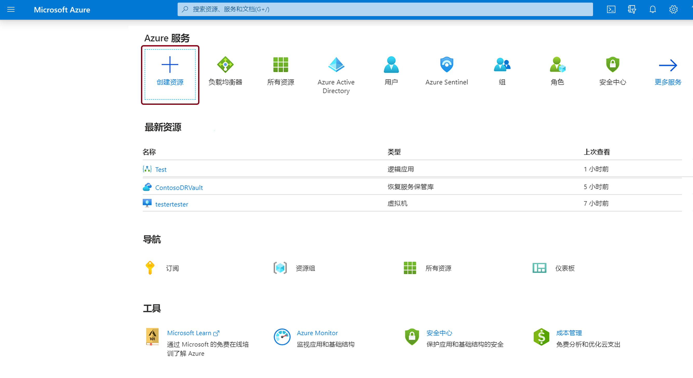
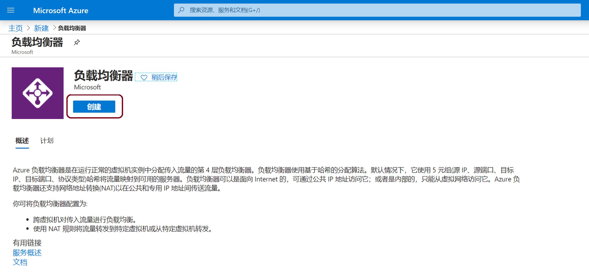
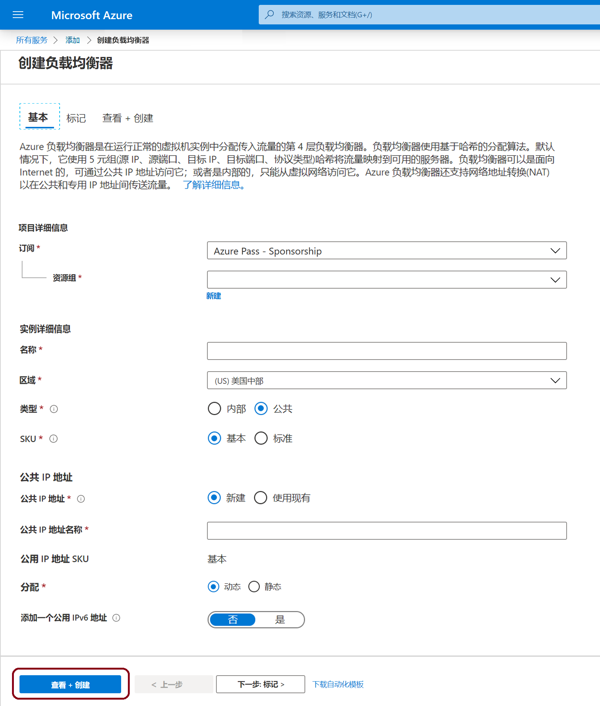

# 迷你实验室：创建负载均衡器以对 VM 进行负载均衡

登录至 Azure 门户，网址：[https://portal.azure.com](https://portal.azure.com/)

## 创建负载均衡器

在本小型实验室中，将创建一个负载均衡器，帮助虚拟机实现负载均衡。可以创建一个公共负载均衡器或内部负载均衡器。创建公共负载均衡器时，还必须为负载均衡器创建一个配置为前端的新公共 IP 地址（默认名为 LoadBalancerFrontend）。

1. 选择 **“+ 创建资源”**，键入 *“负载均衡器”*。

。

2. 选择 **“创建”**。

。

3. 在 **“创建负载均衡器”** 页面的 **“基本”** 选项卡中，输入或选择以下信息，接受其余的默认设置，然后选择 **“审阅 + 创建”**：

“创建标准负载均衡器配置。”。

| 设置 | 数值 |
|------------------------|---------------------------------------------------------------------------------------------------------------------------------------------------------------------------------------------------------------|
| 订阅 | 选择你的订阅。 |
| 资源组 | 选择 **“新建”**，在文本框中键入 *“myResourceGroupSLB”*。 |
| 名称 | *myLoadBalancer* |
| 区域 | 选择 **“西欧”**。 |
| 类型 | 选择 **“公共”**。 |
| SKU | 选择 **“标准”** 或 **“基本”**。Microsoft 建议将“标准”用于生产工作负载。 |
| 公共 IP 地址 | 选择 **“新建”**。如果想使用现有的公共 IP，请选择 **“使用现有”** |
| 公共 IP 地址名 | 在文本框中键入 *“myPublicIP”*。   使用 ```-SKU Basic``` 创建一个基本的公共 IP。基本公共 IP 与**标准**负载均衡器不兼容。Microsoft 建议将**标准**用于生产工作负载。 |
| 可用区域： | 键入 *“区域冗余”* 以创建一个可复原的负载均衡器。要创建区域负载均衡器，请从 1、2 或 3 中选择一个特定区域 |

>**重要提示**
该小型实验室假设在上述 SKU 选择过程中选择了标准 SKU。


## 创建负载均衡器资源

在本部分中，将为后端地址池和运行状况探测配置负载均衡器设置，并指定负载均衡器规则。

## 创建一个后端池

为了将流量分配给 VM，后端地址池包含连接到负载均衡器的虚拟 NIC 的 IP 地址。创建后端地址池 myBackendPool，以包括用于实现 Internet 流量负载均衡的虚拟机。

1. 从左侧菜单中选择 **“所有服务”**，选择 **“所有资源”**，然后从资源列表中选择 **“myLoadBalancer”**。

2. 在 **“设置”** 下面，选择 **“后端池”**，然后选择 **“添加”**。

3. 在 **“添加后端池”** 页面，对于名称，键入 *“myBackendPool”* 作为后端池的名称，然后选择 **“添加”**。

## 创建运行状况探测器

若要允许负载均衡器监视应用的状态，请使用运行状况探测。运行状况探测根据对运行状况检查的响应，动态地从负载均衡器轮换中添加或删除 VM。创建运行状况探测 myHealthProbe，监视 VM 的运行状况。

1. 从左侧菜单中选择 **“所有服务”**，选择 **“所有资源”**，然后从资源列表中选择 **“myLoadBalancer”**。

2. 在 **“设置”** 中，选择 **“运行状况探测”**，然后选择 **“添加”**。

| 设置 | 数值 |
|---------------------|-------------------------------------------------------------------------------------------------------------------------------|
| 名称 | 输入 *“myHealthProbe”*。 |
| 协议 | 选择 **“HTTP”**。 |
| 端口 | 输入 *“80”*。 |
| 间隔 | 输入 *“15”* 作为两次探测尝试之间的 **“间隔”** 秒数。 |
| 运行不正常阈值 | 为 **“异常阈值”** 或连续探测故障数选择 **“2”**，这些故障必须在 VM 被认为异常之前发生。 |


3. 选择 **“确定”**。

## 创建负载均衡器规则

负载均衡器规则用于定义如何将流量分配到 VM。你可以为传入流量和后端 IP 池定义前端 IP 配置，以接收流量以及所需的资源和目标端口。创建负载均衡器规则 myLoadBalancerRuleWeb，用于侦听前端 FrontendLoadBalancer 的端口 80，并使用端口 80 将经过负载均衡的网络流量发送到后端地址池 myBackEndPool。

1. 在左侧菜单中选择 **“所有服务”**，选择 **“所有资源”**，然后从资源列表中选择 **“myLoadBalancer”**。

2. 在 **“设置”** 中，选择 **“负载均衡规则”**，然后选择 **“添加”**。

3. 使用以下值来配置负载均衡规则：

| 设置 | 数值 |
|--------------|-----------------------|
| 名称 | 输入 *“myHTTPRule”*。 |
| 协议 | 选择 **“TCP”**。 |
| 端口 | 输入 *“80”*。 |
| 后端端口 | 输入 *“80”*。 |
| 后端池 | 选择 **“myBackendPool”**。 |
| 运行状况探测 | 选择 **“myHealthProbe”**。 |


4. 保留其余的默认设置，选择 **“确定”**。

## 创建后端服务器

在本部分，你将创建一个虚拟网络，为负载均衡器的后端池创建三个虚拟机，然后在这些虚拟机上安装 IIS 以帮助测试负载均衡器。

## 虚拟网络和参数

在本部分，你需要在步骤中用以下信息替换以下参数：

| 参数 | 数值 |
|------------------------|--------------------|
| **resource-group-name** | myResourceGroupSLB |
| **virtual-network-name** | myVNet |
| **region-name** | 西欧 |
| **IPv4-address-space** | 10.1.0.0\16 |
| **subnet-name** | myBackendSubnet |
| **subnet-address-range** | 10.1.0.0\24 |


## 创建虚拟网络

在本部分中，你将创建虚拟网络和子网。

1. 在屏幕的左上角，选择 **“创建资源”>“网络”>“虚拟网络”** 或在搜索框中搜寻 *“虚拟网络”*。

2. 在 **“创建虚拟网络”** 中，在 **“基本”** 选项卡中输入或选择以下信息。

| 设置 | 数值 |
|------------------|----------------------------------------------------------------------------------------------------------------------------------|
| **项目详情** |  |
| 订阅 | 选择你的 Azure 订阅 |
| 资源组 | 选择 **“新建”**，输入 **“resource-group-name”**，然后选择 **“确定”**，或根据参数选择一个现有的**资源组名称**。 |
| **实例详情**|  |
| 名称 | 输入 **“virtual-network-name”** |
| 区域 | 选择 **“region-name”** |

3. 选择 **“IP 地址”** 选项卡或选择 **“下一步: ”** 页面底部的 **“IP 地址”** 按钮。

4. 在 **“IP 地址”** 标签中，输入以下信息：

| 设置 | 数值 |
|--------------------|----------------------------|
| IPv4 地址空间 | 输入 **“IPv4-address-space”** |


5. 在 **“子网名称”** 下，选择单词 **“默认”**。

6. 在 **“编辑子网”** 中，输入以下信息：

| 设置 | 数值 |
|----------------------|------------------------------|
| 子网名称 | 输入 **subnet-name** |
| 子网地址范围 | 输入 **subnet-address-range** |


7. 选择 **“保存”**。

8. 选择 **“查看 + 创建”** 选项卡或选择 **“查看 + 创建”** 按钮。

9. 选择 **“创建”**。

## 创建虚拟机

公共 IP SKU 和负载均衡器 SKU 必须匹配。对于标准负载均衡器，请在后端池中使用具有标准 IP 地址的 VM。在本部分中，你将在三个不同的区域 （*myVM1、myVM2*  和 *myVM3*），（*区域 1、区域 2* 和 *区域 3*）中创建三个有标准公共 IP 地址的 VM 这些 VM 后来又添加到之前创建的负载均衡器的后端池中如果选择“基本”，请使用具有基本 IP 地址的 VM。

1. 在门户的左上角，选择 **“创建资源” > “计算” > “Windows Server 2019 数据中心”**。

2. 在 **“创建虚拟机”** 中，在 **“基本”** 选项卡中键入或选择以下值：

- **“订阅” > “资源组”**： 选择 **“myResourceGroupSLB”**。

- **“实例详细信息” > “虚拟机名称”**： 键入 *“myVM1”*。

- **“实例详细信息”>“区域”** > 选择 **“西欧”**。

- **“实例详细信息”>“可用性选项”** > 选择 **“可用性区域”**。

- ** “实例详细信息”>“可用性区域”** > 选择 **“1”**。

- **管理员帐户** > 输入 **“用户名”、“密码”** 和 **“确认密码”** 信息。

- 选择 **“联网”** 选项卡，或选择 **“下一步: 磁盘”**， 然后选择 **“下一步: 联网”**。

3. 在 **“联网”** 选项卡上，请确保选择以下内容：

- **虚拟网络**： *myVnet*

- **子网**： *myBackendSubnet*

- **公共 IP** > 选择 **“新建”**。在 **“创建公共 IP 地址”** 窗口中，对于 **“SKU”**，选择 **“标准”**，对于 **“可用性区域”**，选择 **“区域冗余”**，然后选择 **“确定”**。如果已创建基本负载均衡器，请选择“基本”。Microsoft 建议将“标准 SKU”用于生产工作负载。

- 要创建新的网络安全组 (NSG)（一种防火墙），请在 **“网络安全组”** 下面， 选择 **“高级”**。 

1. 在 **“配置网络安全组”** 字段中，选择 **“新建”**。

2. 键入 *“myNetworkSecurityGroup”*，然后选择 **“确定”**。

- 要使 VM 成为负载均衡器后端池的一部分，请完成以下步骤： 
	
	- 在 **“负载均衡”** 中，对于 **“将此虚拟机放在现有的负载均衡解决方案后面？”**， 选择 **“确定”**。
	
	- 在 **“负载均衡设置”** 中，对于 **“负载均衡选项”**，选择 **“Azure 负载均衡器”**。
	
	- 对 **于“选择一个负载均衡器”**，选择 *“myLoadBalancer”*。
	
	- 选择 **“管理”** 选项卡，或选择 **“下一步 ” > “管理”**。

4. 在 **“管理”** 选项卡中，在 **“监控”** 下面，将 **“开机诊断”** 设置为 **“关闭”**。

5. 选择 **“查看 + 创建”**。

6. 查看设置，然后选择 **“创建”**。

7. 按照步骤 2 到 6，使用以下值另外创建两个 VM，所有其他设置与 *myVM1* 相同：

| 设置 | VM 2 | VM 3 |
|-------------------------------|---------------------------------------------|---------------------------------------------|
| 名称 | *myVM2* | *myVM3* |
| 可用区域： | 2 个 | 3 个 |
| 公共 IP | **标准** SKU | **标准** SKU |
| 公共 IP – 可用性区域 | **区域冗余** | **区域冗余** |
| 网络安全组 | 选择现有的 *“myNetworkSecurity Group”* | 选择现有的 *“myNetworkSecurity Group”* |
|  |  |  |


## 创建 NSG 规则

在本部分中，将创建一个网络安全组规则，以允许使用 HTTP 的入站连接。

1. 选择左侧菜单中的 **“所有服务”** 。选择 **“所有资源”**，然后从资源列表中选择位于 **“myResourceGroupSLB”** 资源组中的 **“myNetworkSecurityGroup”**。

2. 在 **“设置”** 下面，选择 **“入站安全规则”**，然后选择 **“添加”**。

3. 为名为 **“myHTTPRule”** 的入站安全规则输入这些值，以允许使用端口 **“80”** 的入站 HTTP 连接： 

- **源**： *服务标记*

- **源服务标记**： *Internet*

- **目标端口范围**： *80 个*

- **协议**： *TCP*

- **操作**： *允许*

- **优先级**： *100 个*

- **名称**： *myHTTPRule*

- **描述**： *允许 HTTP*

4. 选择 **“添加”**。

5. 如果需要，请使用以下不同的值重复入站 RDP 规则的步骤： 

- **目标端口范围**： 键入 *“3389”*。

- **优先级**： 键入 *200*。

- **名称**： 键入 *“MyRDPRule”*。

- **描述**： 键入 *“允许 RDP”*。

## 安装 IIS

1. 在左侧菜单中单击 **“所有服务”**，选择 **“所有资源”**，然后从资源列表中选择 **“myVM1”**，该选项位于 *“myResourceGroupLB”* 资源组中。

2. 在 **“概览”** 页面上，单击 **“连接”**，将 RDP 连接到 VM。

3. 使用在创建此 VM 时提供的凭据登录 VM。这将启动与虚拟机 *“- myVM1”* 的远程桌面会话。

4. 在服务器桌面上，导航到 **“Windows 管理工具” > “Windows PowerShell”**。

5. 在 PowerShell 窗口中，运行以下命令以安装 IIS 服务器，删除默认的 iisstart.htm 文件，并添加一个显示 VM 名称的新 iisstart.htm 文件：

```PowerShell
# 安装 IIS 服务器角色
 Install-WindowsFeature -name Web-Server -IncludeManagementTools

 # 删除默认的 htm 文件
  remove-item  C:\inetpub\wwwroot\iisstart.htm

 # 添加一个显示服务器名称的新 htm 文件
  Add-Content -Path "C:\inetpub\wwwroot\iisstart.htm" -Value $("Hello World from " + $env:computername)
```

6. 关闭与 *myVM1* 的 RDP 会话。

7. 重复步骤 1 至 6，在 *myVM2* 和 *myVM3* 上安装 IIS 和更新的 iisstart.htm 文件。

## 测试负载均衡器

1. 在**概览**屏幕上找到负载均衡器的公共 IP 地址。在左侧菜单中选择 **“所有服务”**，选择 **“所有资源”**，然后选择 **“myPublicIP”**。

2. 复制公共 IP 地址，然后将其粘贴到浏览器的地址栏中。IIS 网络服务器的默认页面显示在浏览器上。


要查看负载均衡器在所有三个 VM 之间分配流量，你可以自定义每个 VM 的 IIS Web 服务器的默认页面，然后从客户端计算机强制刷新 Web 浏览器。
