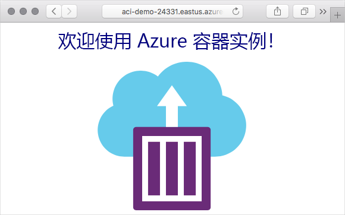

# 迷你实验室：运行 Azure 容器实例

在本实验室中，你将在 Azure 中创建一个容器，并使用完全限定的域名 (FQDN) 将其公开到 Internet。

Azure 容器实例对在隔离容器中运行的方案非常有用，包括简单应用程序、任务自动化和生成作业。以下是一些优点：

* **快速启动**：在几秒钟内启动容器。

* **每秒计费**：仅在容器运行时产生费用。

* **虚拟机监控程序级别安全**：与在 VM 中一样，完全隔离应用程序。

* **自定义大小**：指定 CPU 内核和内存的确切值。

* **持久存储**：将 Azure 文件存储共享直接装载到容器以检索并保持状态。

* **Linux 和 Windows**：使用相同的 API 调度 Windows 和 Linux 容器。

对于需要完整容器业务流程的方案，其中包括跨多个容器的服务、自动缩放和协调式应用程序升级，我们都会建议使用 Azure Kubernetes 服务 (AKS)。

## 创建容器

1. 使用你的 Azure 订阅登录 Azure 门户：[https://portal.azure.com](https://portal.azure.com/)。

2. 你还可以使用 Cloud Shell 图标从 Azure 门户中打开 Azure Cloud Shell。


3. 新建一个名为 **learn-deploy-aci-rg** 的资源组，以便在使用完模块后能够更轻松地清理这些资源。如果选择了不同的资源组名称，请记住该名称，因为本模块的其余练习中会用到。你还需要选择一个要在其中创建资源组的区域，例如**美国东部**。

```Azure CLI
az group create --name learn-deploy-aci-rg --location eastus
```

通过向 ```az container create``` 命令提供名称、Docker 映像和 Azure 资源组来创建容器。通过指定 DNS 名称标签可选择向 Internet 公开容器。在此示例中，你将部署一个承载小型 Web 应用的容器。你还可以选择放置图片的位置，你将使用 **“美国东部”** 地区，但可以将其更改为你附近的位置。

4. 提供一个 DNS 名称，以向 Internet 公开你的容器。你的 DNS 名称必须唯一。出于学习目的，请通过 Cloud Shell 运行此命令，以创建具有唯一名称的 Bash 变量。

```Azure CLI
DNS_NAME_LABEL=aci-demo-$RANDOM
```

5. 运行以下 ```az container create``` 命令以启动容器实例。

```Azure
az container create \
  --resource-group learn-deploy-aci-rg \
  --name mycontainer \
  --image microsoft/aci-helloworld \
  --ports 80 \
  --dns-name-label $DNS_NAME_LABEL \
  --location eastus
```

```$DNS_NAME_LABEL``` 指定你的 DNS 名称。映像名称 **microsoft/aci-helloworld** 是指托管在运行基本的 Node.js Web 应用程序的 Docker Hub 的 Docker 映像。

6. ```az container create``` 命令完成时，请运行 ```az container show``` 以检查其状态。

```Azure CLI
az container show \
  --resource-group learn-deploy-aci-rg \
  --name mycontainer \
  --query "{FQDN:ipAddress.fqdn,ProvisioningState:provisioningState}" \
  --out table
```

查看容器的完全限定的域名 (FQDN) 及其预配状态。示例如下。

```output
FQDN ProvisioningState

-------------------------------------- -------------------

aci-demo.eastus.azurecontainer.io Succeeded
```

如果容器处于 **“正在创建”** 状态，请稍等片刻，然后再次运行命令，直到显示 **“创建成功”** 状态。

7. 在浏览器中，导航到容器的 FQDN 并查看其运行情况。


