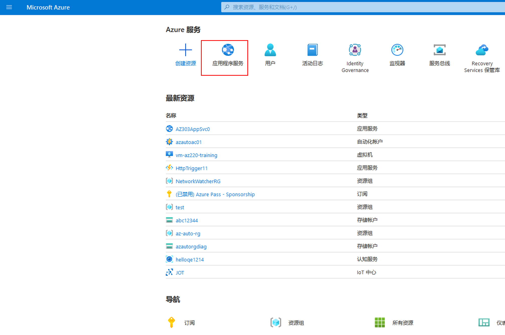
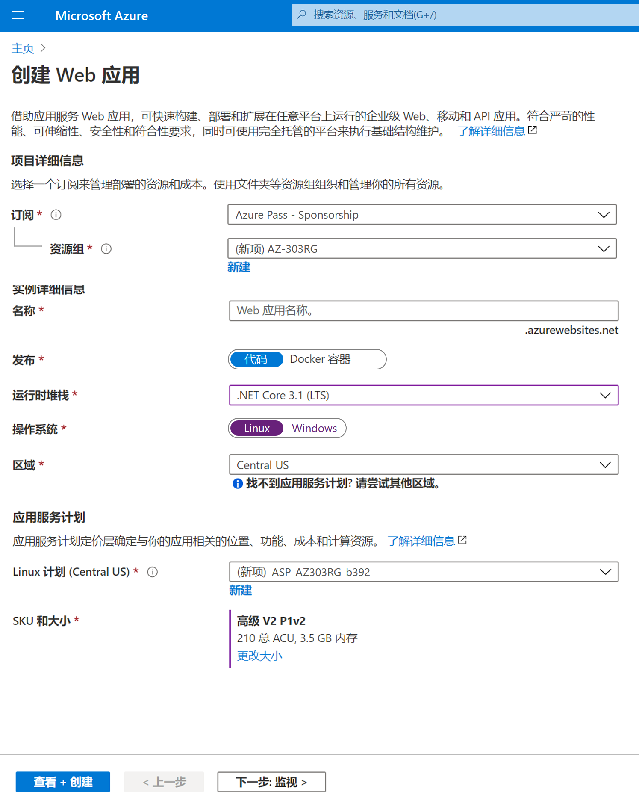
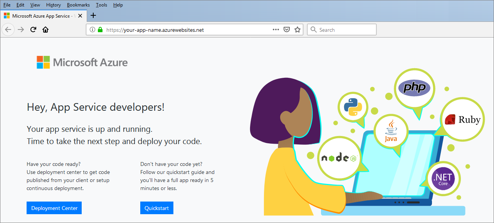

# 迷你实验室：创建应用服务和 Web 应用

此演示将使用 Azure 门户创建 Web 应用和 Azure 应用服务。

## 创建应用服务和 Web 应用

1. 登录至 Azure 门户，网址：[https://portal.azure.com](https://portal.azure.com/)

1. 在 Azure 门户菜单或 **“主页”** 上，选择 **“应用服务”**。 

    

2. 在 **“应用服务页面”** 上，选择 **“创建应用服务”**。 

    

3. 在 **Web 应用** 中，完成以下值：

| 字段 | 数值 | 详细信息 |
|------------------|-----------------------------------------------|-------------------------------------------------------------------------------------------------------------------------------------------------------------------------------------------------------------------------------------------------------------------------------------------------------------------------|
| 订阅 | 选择你的订阅 | 正在创建的 Web 应用必须属于一个资源组。在这里，选择资源组所属的 Azure 订阅（如果正在在向导中创建资源组，则选择其将来所属的 Azure 订阅）。 |
| 资源组 | 从菜单中选择 | Web 所属的资源组。所有 Azure 资源必须属于一个资源组。 |
| 名称 | 输入唯一名称 | Web 应用的名称。该名称将成为应用 URL 的一部分：appname.azurewebsites.net。所选择的名称在所有 Azure Web 应用中必须是唯一的。 |
| 发布 | 代码 | 用来发布应用程序的方法。当以代码形式发布应用程序时，还必须配置运行时堆栈，以准备应用服务资源来运行应用。 |
| 运行时堆栈 | .NET Core 3.1 (LTS) | 应用程序运行的平台。你的选择可能会影响是否可以选择操作系统 – 对于某些运行时堆栈，应用服务仅支持一种操作系统。 |
| 操作系统 | Linux | 在运行应用的虚拟服务器上使用的操作系统。 |
| 区域 | 美国中部 | 将托管应用的地理区域。 |
| Linux 计划 | 保留默认设置 | 为应用提供支持的应用服务计划的名称。默认情况下，该向导将在与 Web 应用相同的区域中创建一个新计划。 |
| SKU 和大小 | 默认 | 正在创建的计划的定价层。这决定了为应用提供支持的虚拟服务器的性能特征，以及应用可以访问的功能。若要选择“F1”层，请选择“更改大小”，以打开“规格选取器”向导。在“开发/测试”选项卡中，从列表中选择“F1”，然后选择“应用”。 |

4. 选择 **“审阅并创建”** 导航到审阅页面，然后选择 **“创建”** 创建 Web 应用。

    

> **注意**： 创建 Web 应用并准备就绪可能需要花费几秒钟。

门户将显示“部署”页面，你可以在其中查看部署状态。 

## 预览 Web 应用

应用就绪后，请在 Azure 门户中导航到新应用：

1. 在 Azure 门户菜单或 **“主页”** 上，选择 **“所有资源”**。

2. 从列表中为 Web 应用选择应用服务。确保选择“应用服务”而不是“应用服务计划”。

    

    门户显示 **“应用服务概述”** 页面。

    

1. 想预览新 Web 应用的默认内容，请选择右上角的 URL。加载的占位符页面表明你的 Web 应用已启动并正在运行，并准备接收应用代码的部署。

    

 
