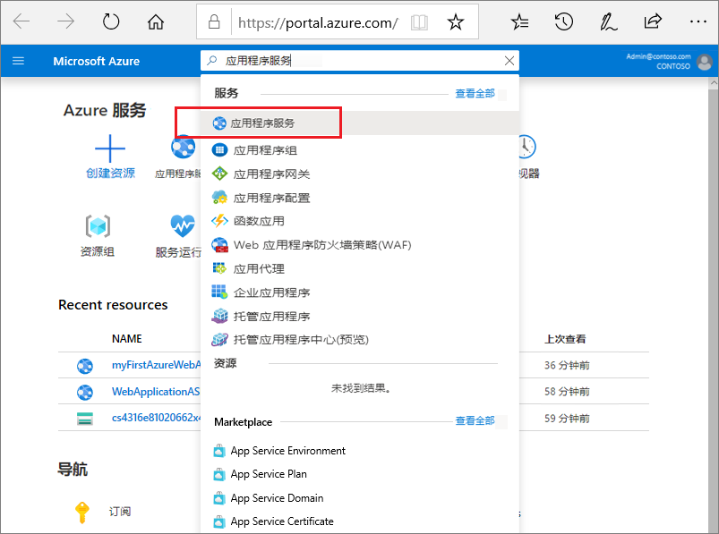
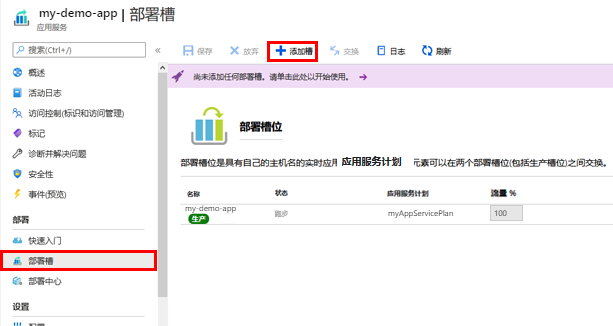
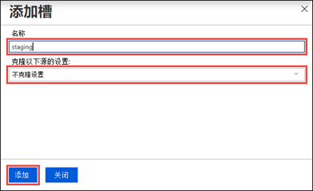
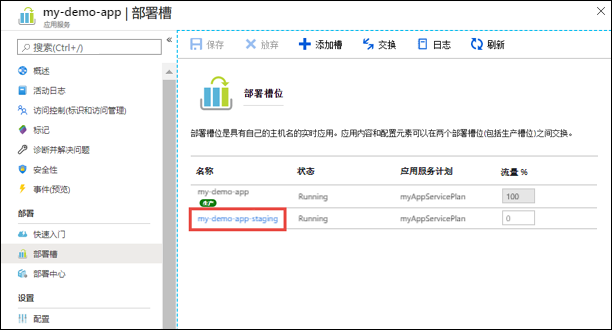
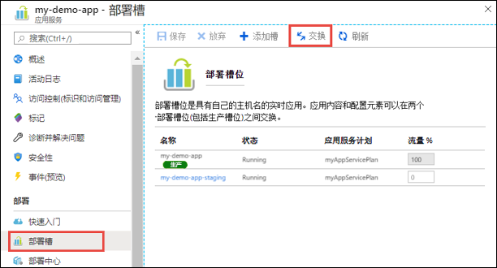
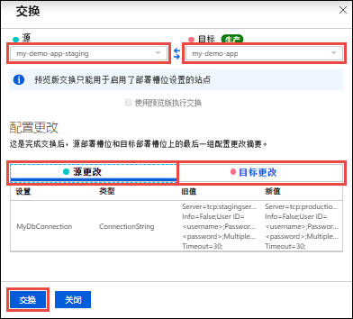

# 迷你实验室：部署暂存槽位

将应用程序部署到非生产槽位具有以下优点：

* 将过渡部署槽位与生产槽位交换之前，可以在过渡部署槽中验证应用更改。
* 首先将应用部署到一个槽位，然后将其交换到生产，这确保该槽位的所有实例都已准备好，然后交换到生产。部署应用时，这样可避免停机。流量重定向是无缝的，且不会因为交换操作而丢弃任何请求。不需要进行切换前验证时，可以通过配置[自动切换](#Auto-Swap)实现整个工作流的自动化。
* 交换后，具有以前过渡应用的槽位现在具有以前的生产应用。如果交换到生产槽的更改与预期不同，可以立即执行同一交换来收回“上一已知的良好站点”。

## 添加槽位
必须在**标准**层、 **高级**层或**独立**层中运行应用才能启用多个部署槽位。

1. 登录至 Azure 门户，网址：[https://portal.azure.com](https://portal.azure.com/)搜索并选择 **“应用服务”**，然后选择你的应用。 
   
    
   
2. 在左侧窗格中，选择 **“部署槽位”** > **“添加槽位”**。
   
    
   
   > **注意：** 如果应用尚未处于 **“标准”**、 **“高级”** 或 **“独立”** 层，你将收到一条消息，指示支持启用分阶段发布的层。此时，你可以选择 **“升级”** 并转到应用的 **“缩放”** 选项卡，然后再继续操作。

3. 在 **“添加槽”** 对话框中，为槽提供一个名称，并选择是否要从其他部署槽位中克隆应用程序配置。选择 **“添加”** 以继续。
   
    
   
    可以从任何现有槽克隆配置。可以克隆的设置包括应用设置、连接字符串、语言框架版本、Web 套接字、HTTP 版本和平台位数。

4. 添加槽后，选择 **“关闭”** 来关闭对话框。新槽现在显示在 **“部署槽”** 页面中。默认情况下，新槽的**流量 %** 设置为 0，所有客户流量都路由到生产槽 。

5. 选择新部署槽以打开该槽的资源页。
   
    

    过渡槽具有管理页面，就像任何其他应用服务应用一样。可以更改此槽的配置。为了提醒你你正在查看部署槽位，应用名称显示为 **\<app-name>/\<slot-name>**，应用类型为**应用服务（槽位）**。你还可以看到槽位在资源组中是单独的应用，使用相同的名称。

即使从其他槽克隆设置，新的部署槽也无内容。例如，可以使用 Git 发布到此槽。可以从其他存储库分支或不同的存储库部署到槽。

## 切换两个槽位 
你可以在应用的 *“部署槽位”** 页面和 *“概览”** 页面上切换部署槽位。

> **重要事项：** 在将应用从部署槽位交换到生产槽位之前，请确保生产槽位是目标槽位，源槽位中的所有设置的配置与你对生产槽位的预期配置完全相同。

要切换部署槽位：

1. 前往应用的 *“部署槽位”** 页面并选择 **“交换”**。
   
    

    **“交换”** 对话框显示将变更的所选源槽和目标槽中的设置。

2. 选择所需的 **“资源”** 和 **“目标”** 槽。通常，目标是生产插槽。此外，选择 **“源更改”** 和 **“目标更改”** 选项卡，并验证配置更改是否符合预期。完成后，可以通过选择 **“交换”** 来立即交换槽位。

    

3. 完成后，选择 **“关闭”**，关闭对话框。
