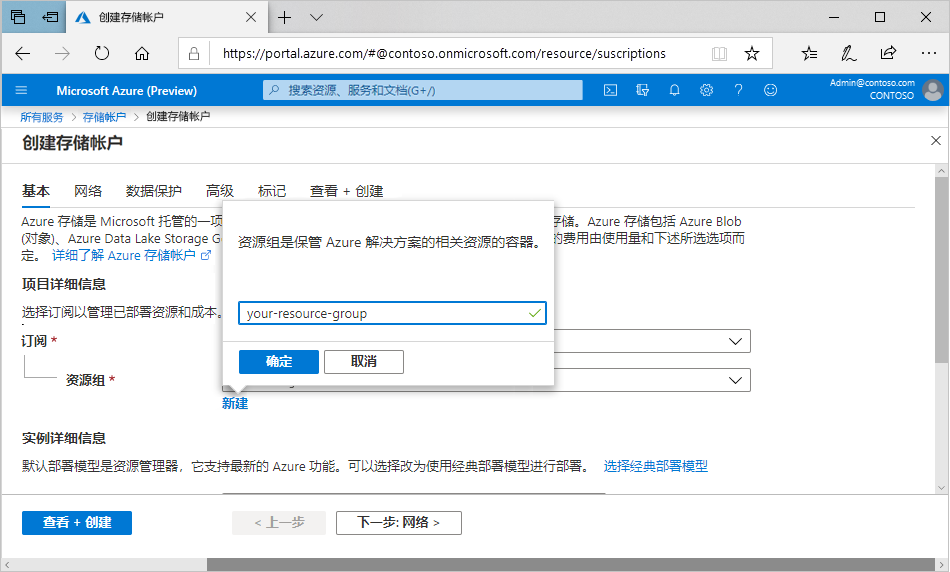

# 迷你实验室：在门户中创建存储帐户

每个存储帐户必须属于Azure 资源组。资源组是对 Azure 服务进行分组的逻辑容器。创建存储帐户时，可选择创建新的资源组，也可使用现有资源组。本文介绍如何创建新的资源组。

常规用途 v2 存储帐户可访问所有 Azure 存储服务：Blob、文件、队列、表和磁盘。此处列出的步骤创建一个常规用途 v2 存储帐户，但创建各类存储帐户的步骤都类似。

按照下列步骤在 Azure 门户中创建通用 v2 存储帐户：

1. 在 Azure 门户菜单中，选择 **“所有服务”**。在资源列表中，键入 **“存储帐户”**。开始键入时，列表会根据你的输入进行筛选。选择 **存储帐户**。

1. 在 **存储帐户** 窗口出现时，选择 **添加**。

1. 选择要在其中创建存储帐户的订阅。

1. 在 **资源组** 字段中，选择 **新建**。输入新资源组的名称，如下图所示。

    

1. 接下来，输入存储帐户的名称。选择的名称在 Azure 中必须是唯一的。名称的长度也必须介于 3 到 24 个字符之间，且只能包含数字和小写字母。

1. 选择存储帐户的位置，或使用默认位置。

1. 将这些字段设置为默认值：

    | 字段| 数值|
    | :--- | :--- |
    | 部署模型| 资源管理器|
    | 性能| 标准|
    | 帐户类型：| StorageV2（通用 v2）|
    | 复制| 读取访问异地冗余存储 (RA-GRS)|
    | 访问层| 热|

1. 选择 **“查看 + 创建”** 以查看存储帐户设置并创建帐户。

1. 选择 **创建**。

>:heavy_check_mark: **注意：** 我们将在本模块稍后的其他演示/演练中使用在此演示期间创建的存储帐户。
