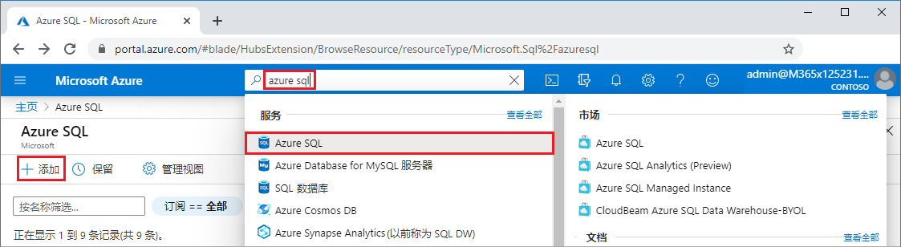
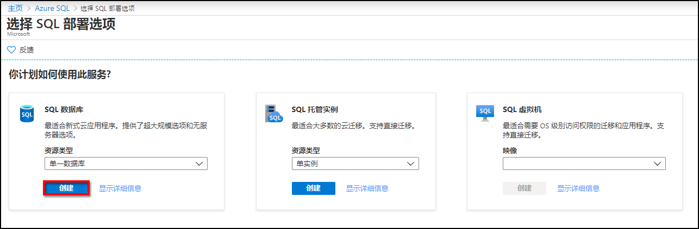
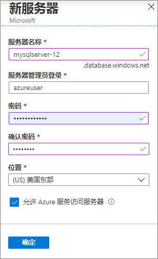
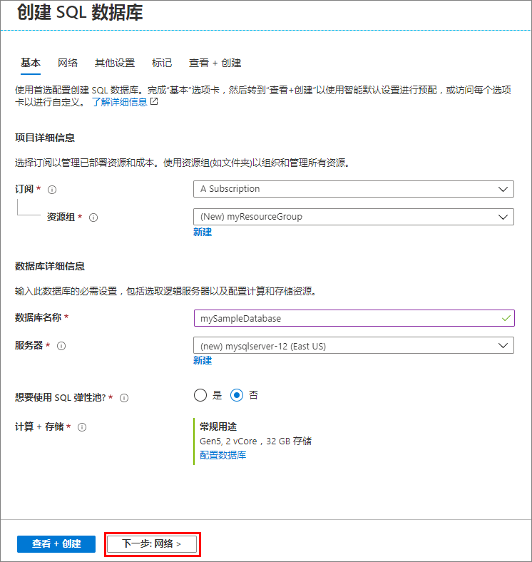
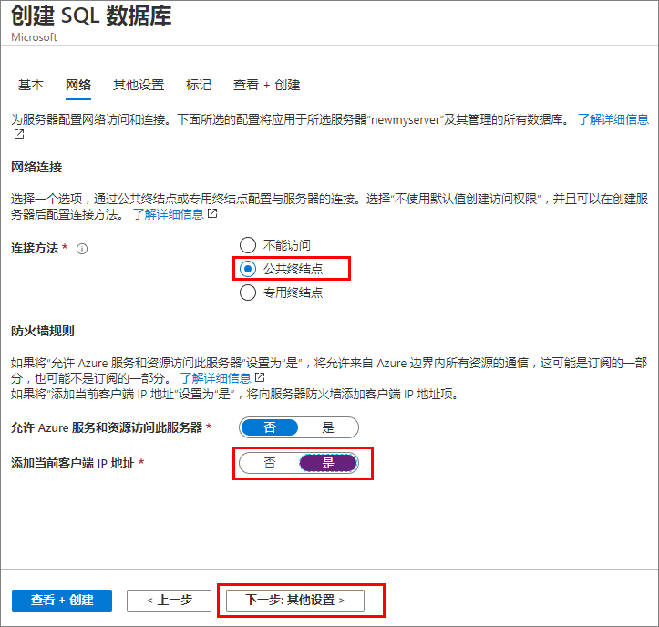
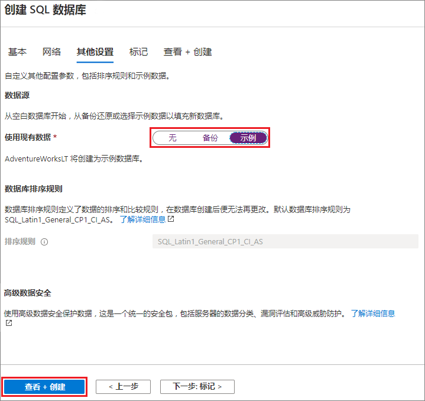
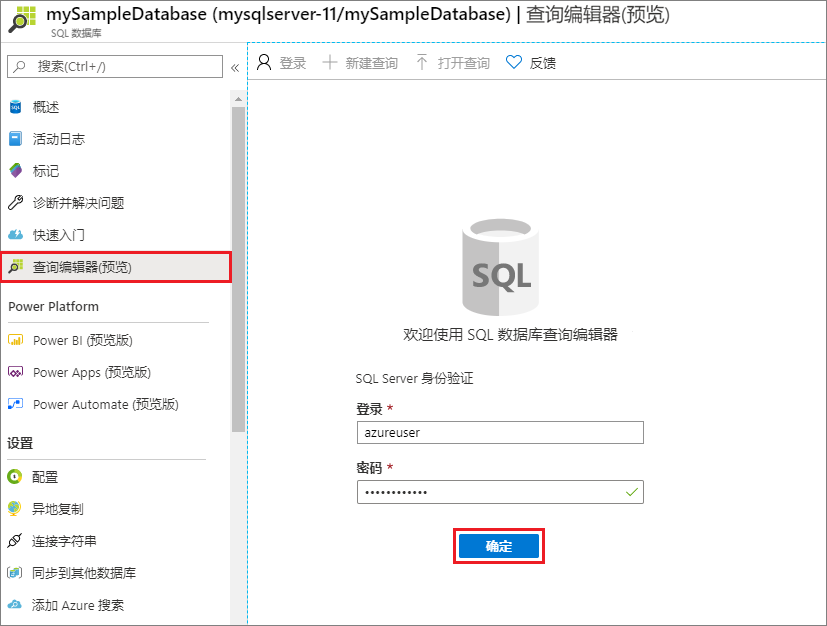
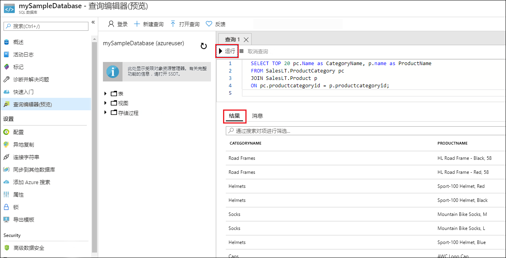

# 迷你实验室：创建 Azure SQL 数据库单数据库

在此小型实验室中，你将使用 Azure 门户创建 Azure SQL 数据库单一数据库。然后，你将使用 Azure 门户中的查询编辑器查询数据库。

单一数据库是 Azure SQL 数据库最快、最简单的部署选项。可以管理 SQL Database 服务器内的单一数据库，它位于指定 Azure 区域中的 Azure 资源组内。在本迷你实验室中，你将为新数据库创建一个新的资源组和 SQL Server。

可以在 *“已预配”* 或 *“无服务器”* 计算层中创建单一数据库。预配数据库会预先分配固定数量的计算资源（包括 CPU 和内存），并使用两种购买模型中的一种。该微型实验室使用基于 vCore 的购买模型创建预配数据库。

## 创建单一数据库

在该步骤中，你将创建一个 Azure SQL 数据库服务器和一个使用 AdventureWorksLT 示例数据的单一数据库。可以使用 Azure 门户菜单和屏幕，或者使用 Azure Cloud Shell 中的Azure CLI 或 PowerShell 脚本来创建数据库。

若要在 Azure 门户中创建资源组、SQL Server 和单一数据库，请执行以下操作：

1. 登录至 Azure 门户，网址：[https://portal.azure.com](https://portal.azure.com/)

2. 在搜索栏中，搜索并选择 **“Azure SQL”**。

3. 在“Azure SQL”页面上，选择 **“添加”**。



4. 在 **“选择 SQL 部署选项”** 页面上选择 **“SQL 数据库”** 磁贴，并在 **“资源”** 类型下选择 **“单一数据库”**。可以通过选择 **“显示详细信息”** 来查看有关不同数据库的更多信息。

5. 选择 **“创建”**。



6. 在“创建 SQL 数据库 **”表单的“基本”** 选项卡的 **“项目详细信息”** 下，选择正确的 Azure 订阅（如果尚未选择）。

7. 在 **“资源组”** 下选择 **“新建”**，输入 *“myResourceGroup”*，然后选择 **“确定”**。

8. 在 **“数据库详细信息”** 下，对于 **“数据库名称”**，输入“mySampleDatabase”。

9. 对于 **“服务器”**，选择 **“新建”** 并按如下所示填写“新服务器”表单：

- **服务器名称**： 输入 *“mysqlserver”* 和一些字符以保持唯一性。

- **服务器管理员登录**： 输入 *“azureuser”*。

- **密码**： 输入符合要求的密码，并在 **“确认密码”** 字段中再次输入该密码。

- **位置**： 下拉并选择一个位置，例如 **“(US) 美国东部”**。

选择 **“确定”**。



记录服务器管理员登录名和密码，以便登录到服务器和数据库。如果忘记了登录名或密码，可在数据库创建后在 **“SQL Server”** 页面获取登录名或重置密码。要打开 **“SQL Server”** 页面，请在数据库 **“概述”** 页上选择服务器名称。

10. 在 **“计算 + 存储”** 下，若要重新配置默认值，请选择 **“配置数据库”**。

在 **“配置”** 页面上，可以选择：

- 将 **“计算层”** 从 **“预配”** 更改为 **“无服务器”**。

- 查看并更改 **“vCore 数”** 和 **“数据最大大小”** 的设置。

- 选择 **“更改配置”** 以更改硬件生成。

进行任何更改后，选择 **“应用”**。

11. 选择 **“下一步:”** 页面底部的 **“网络”**。



12. 在 **“网络”** 选项卡的 **“连接方法”** 下，选择 **“公共终结点”**。

13. 在 **“防火墙规则”** 下，将 **“添加当前客户端 IP 地址”** 设置为 **“是”**。

14. 选择 **“下一步: ”** 页面底部的 **“其他”**设置。




15. 在 **“其他设置”** 选项卡的 **“数据源”** 部分，对于 **“使用现有数据”**，选择 **“示例”**。

16. 选择页面底部的 **“查看 + 创建”**。



17. 查看设置后，选择 **“创建”**。

## 查询数据库

创建数据库后，可使用 Azure 门户中的内置查询编辑器连接到数据库并查询数据。

1. 在门户中搜索并选择 **“SQL 数据库”**，然后从列表中选择你的数据库。

2. 在数据库的 **“SQL 数据库”** 页面，选择左侧菜单中的 **“查询编辑器”**。

3. 输入服务器管理员登录信息，然后选择 **“确定”**。



4. 在“查询编辑器”窗格中输入以下查询。

```SQL

SELECT TOP 20 pc.Name as CategoryName, p.name as ProductName

FROM SalesLT.ProductCategory pc

JOIN SalesLT.Product p

ON pc.productcategoryid = p.productcategoryid;
```

5. 选择 **“运行”**，然后在“结果”窗格中查看查询结果。



6. 关闭 **“查询编辑器”** 页面，并在系统提示是否放弃未保存的编辑时选择 **“确定”**。

 

 
