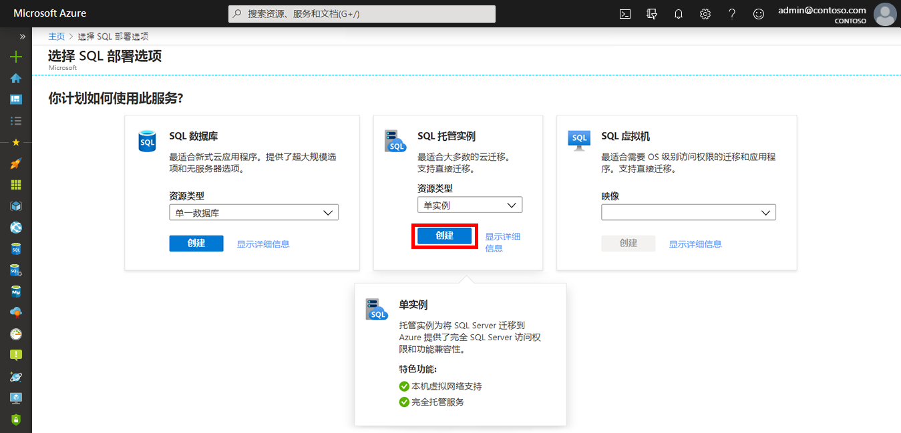
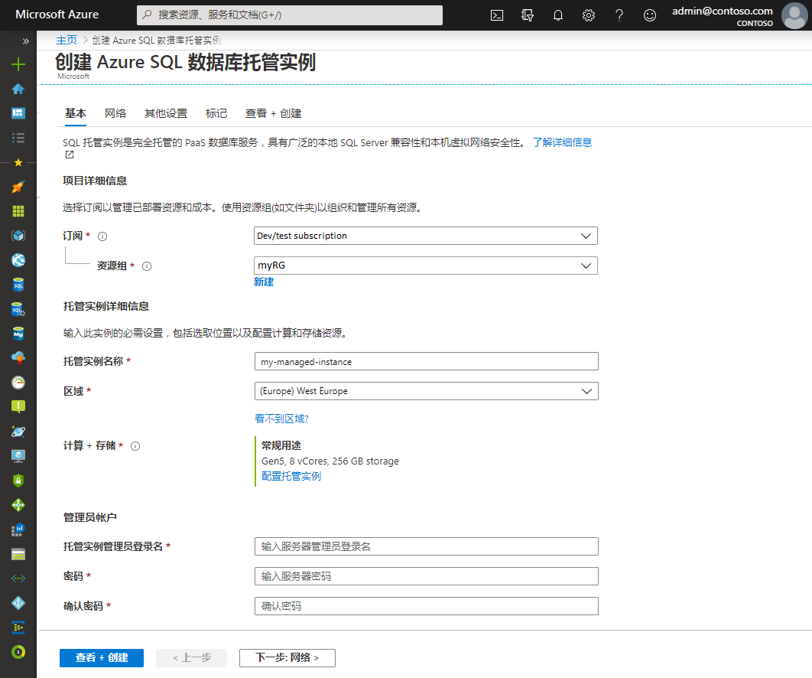
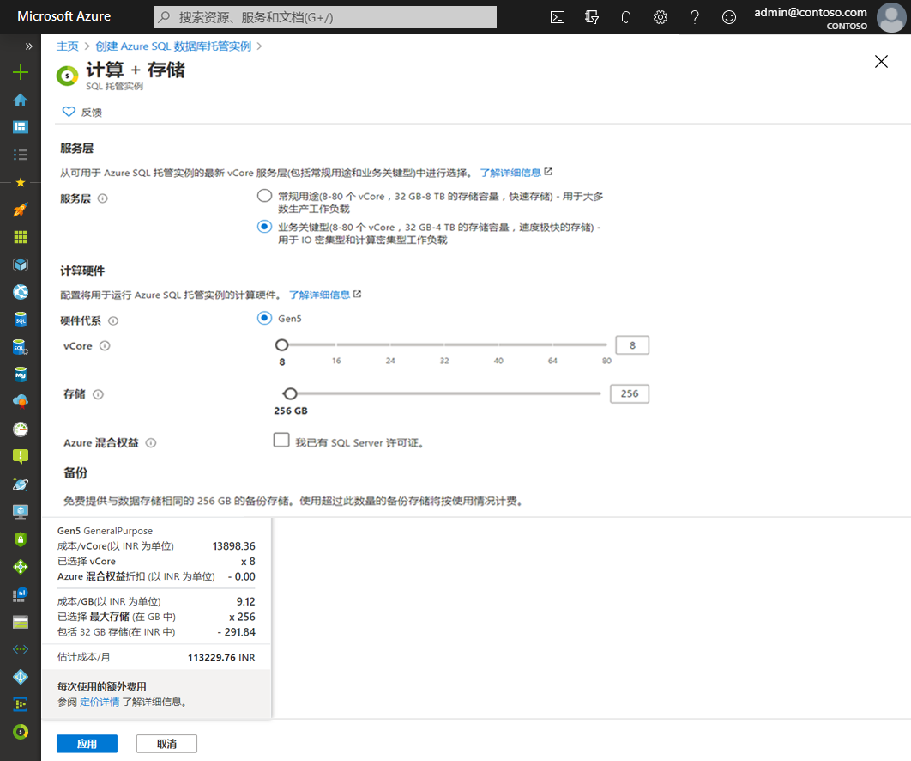
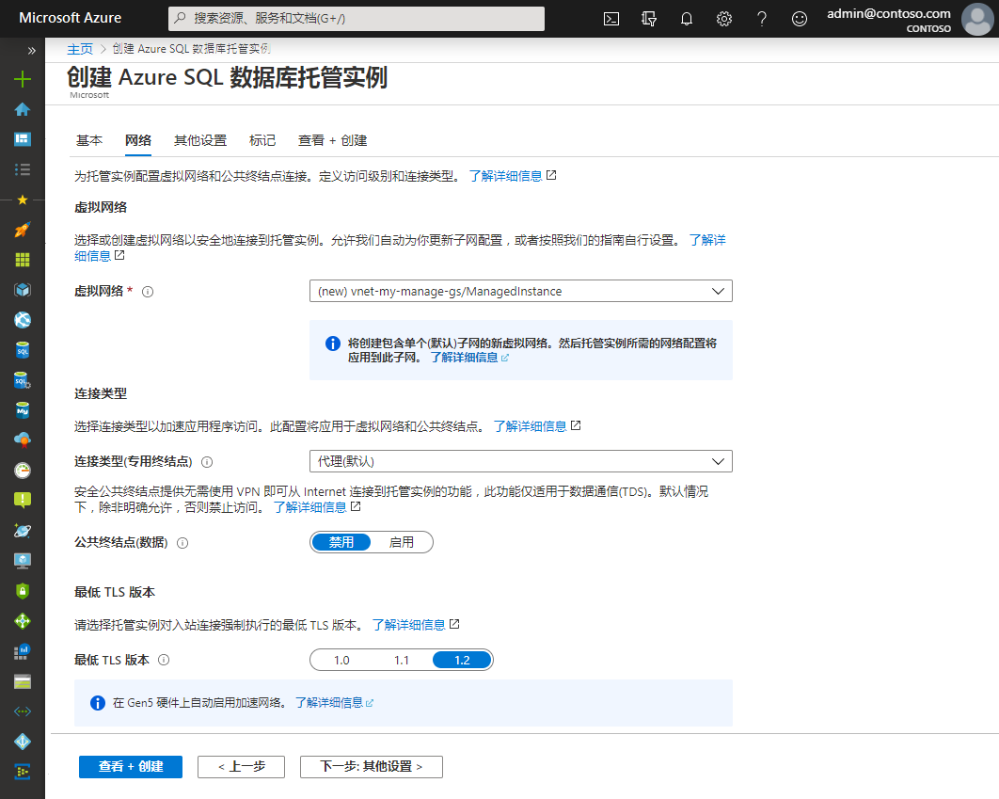
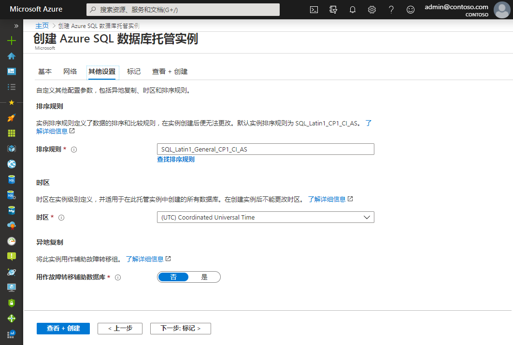
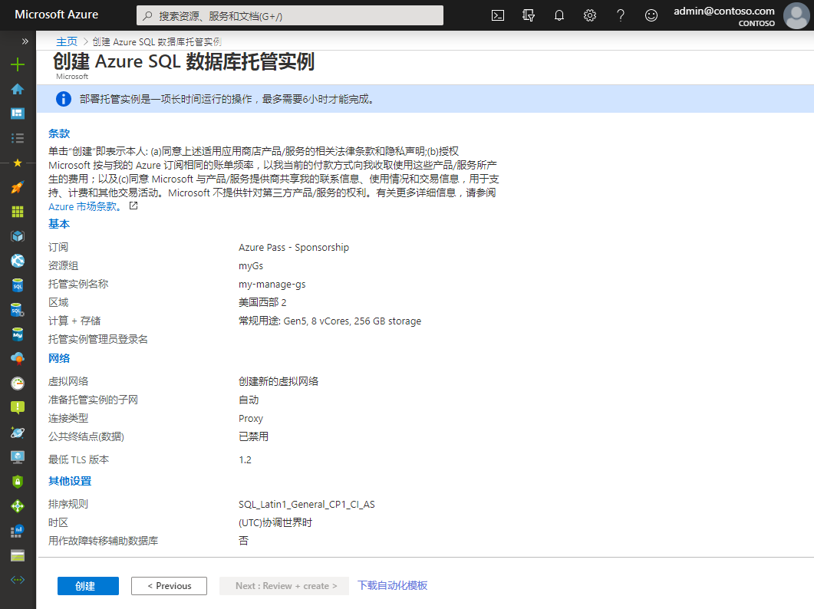

# 微型实验室：创建 Azure SQL 数据库托管实例

本迷你实验室将带你逐步了解如何在 Azure 门户中创建 Azure SQL 数据库托管实例。

登录至 Azure 门户，网址：[https://portal.azure.com](https://portal.azure.com/)

## 创建托管实例

以下步骤介绍如何创建托管实例：

1. 选择 Azure 门户左侧菜单上的 **“Azure SQL”**。如果 **Azure SQL** 不在列表中，选择 **“所有服务”**，然后在搜索框中输入 *“Azure SQL”*。

2. 选择 **“+ 添加”** 以打开 **“选择 SQL 部署选项”** 页。可以通过选择 **“托管实例”** 磁贴上的 **“显示详细信息”** 来查看有关 Azure SQL 数据库托管实例的其他信息。

3. 选择 **“创建”**。

4. 使用 **“创建 Azure SQL 数据库托管实例”** 预配表单上的选项卡来添加必填信息和可选信息。以下各节介绍了这些选项卡。

## 基本

* 填写 **“基本”** 选项卡上的必填信息。

请使用下表作为此选项卡所需信息的参考。

| 设置 | 建议值 | 描述  |
|---------------------------------------------------|---------------------------------------------------------------------------------|-------------------------------------------------------------------------------------------------------------------------------------------------------------------------------------------------------------------------------------------------------------------------------------------------------------------------------------------------------------------------------------------------------------------------------------------------------------------------------------------------------------------------------------------------------------------------------------------------------------------------------------------------------------------------------------------------------------|
| 虚拟网络 | 选择“创建新的虚拟网络”或“有效的虚拟网络和子网”。 | 如果网络或子网不可用，则必须先将其修改为满足网络要求，然后再将其选为新托管实例的目标。有关为托管实例配置网络环境的要求的信息，请参阅“为托管实例配置虚拟网络”。 |
| 连接类型 | 在代理和重定向连接类型之间进行选择。 | 有关连接类型的详细信息，请参阅 Azure SQL 数据库连接策略。 |
| 公共终结点 | 选择“启用”。 | 要使托管实例可通过公共数据终结点访问，需启用此选项。 |
| 允许访问（如果公共终结点已启用） | 选择其中一个选项。 | 门户体验支持使用公共终结点配置安全组。   |

* 选择 **“配置托管实例”** 以调整计算和存储资源的大小并查看定价层。使用滑块或文本框来指定存储量和虚拟核心数。完成后，选择 “**应用**” 以保存你的选择。

* 要在创建托管实例之前查看你的选择，可选择 **“查看 + 创建”**。或者，通过选择 **“下一步: ”** 来配置网络选项 **“网络”**。

## 网络

* 在 **““网络”** 选项卡上填写可选信息。如果你忽略此信息，门户将应用默认设置。

请使用下表作为此选项卡所需信息的参考。

| 设置 | 建议值 | 描述  |
|---------------------------------------------------|---------------------------------------------------------------------------------|------------------------------------------------------------------------------------------------------------------------------------------------------------------------------------------------------------------------------------------------------------------------------------------------------------------------------|
| 虚拟网络 | 选择“创建新的虚拟网络”或“有效的虚拟网络和子网”。 | 如果网络或子网不可用，则必须先将其修改为满足网络要求，然后再将其选为新托管实例的目标。有关为托管实例配置网络环境的要求的信息，请参阅“为托管实例配置虚拟网络”。 |
| 连接类型 | 在代理和重定向连接类型之间进行选择。 | 有关连接类型的详细信息，请参阅 Azure SQL 数据库连接策略。 |
| 公共终结点 | 选择“启用”。 | 要使托管实例可通过公共数据终结点访问，需启用此选项。 |
| 允许访问（如果公共终结点已启用） | 选择其中一个选项。 | 门户体验支持使用公共终结点配置安全组。   |

* 选择 **““查看 + 创建”**，以在创建托管实例之前检查你的选择。或者，配置更多自定义设置，方法是选择 **“下一页: 其他设置”**。

## 其他设置

* 在 **“其他设置”** 选项卡中填写可选信息。如果你忽略此信息，门户将应用默认设置。

请使用下表作为此选项卡所需信息的参考。

| 设置 | 建议值 | 描述  |
|-----------------------------------------------------------------------|------------------------------------------------------------------------------------------------------------------------------------------------------------------------------------------------------------|-----------------------------------------------------------------------------------------------------------------------------------------------------------------------|
| 排序规则 | 选择要用于托管实例的排序规则。如果从 SQL Server 迁移数据库，请使用 SELECT SERVERPROPERTY(N'Collation') 检查源排序规则并使用该值。 | 有关排序规则的信息，请参阅“设置或更改服务器排序规则”。 |
| 时区 | 选择你的托管实例将遵守的时区。 | 有关详细信息，请参阅“时区”。 |
| 用作故障转移辅助 | 选择“是”。 | 启用此选项可将托管实例用作故障转移组辅助。 |
| 主要托管实例（如果“用作故障转移辅助实例”设置为“是”） | 选择一个现有的主托管实例，该实例将与你要创建的托管实例位于同一 DNS 区域中。 | 此步骤将启用故障转移组的创建后配置。  |

## 查看 + 创建

5. 选择 **“查看 + 创建”** 选项卡，以在创建托管实例之前查看你的选择。

6. 选择 **“创建”** 以开始预配托管实例。

 
