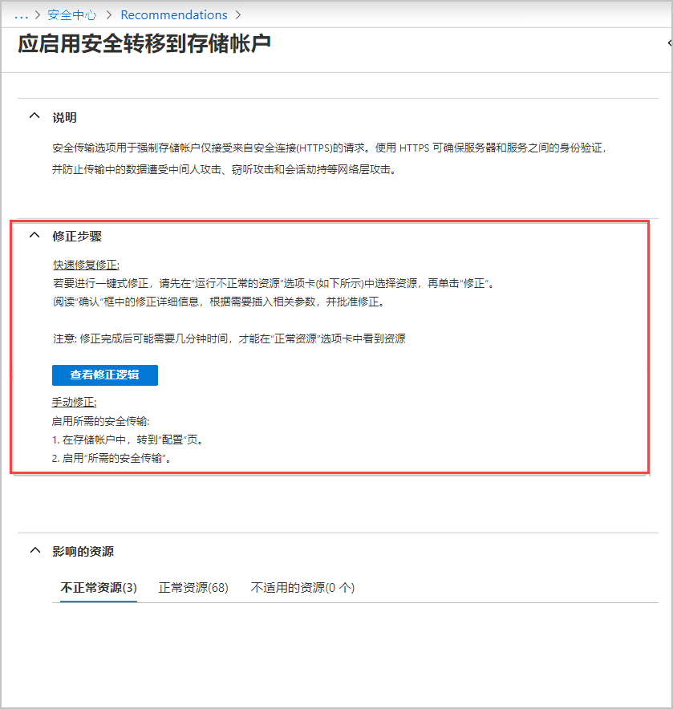
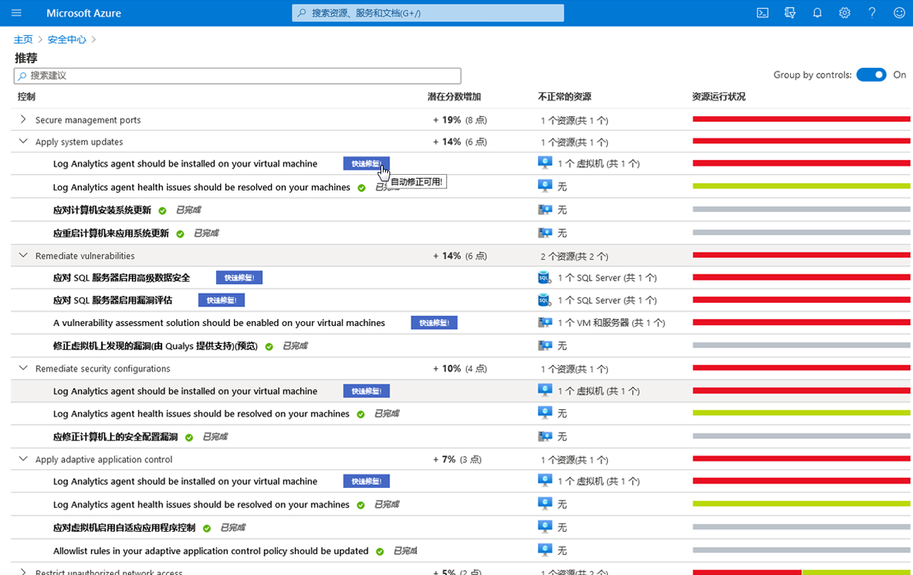

# 迷你实验室：Azure 安全中心

为进行本迷你实验室，需要一个或**多个未**激活监视代理的 Linux VM。

## 导航到 Azure 安全中心

1. 登录至 Azure 门户，网址：[https://portal.azure.com](https://portal.azure.com/)

1. 导航到 **“安全中心”** >  **“建议”**。

## 通过推荐添加监视软件

建议提供了有关如何更好地保护资源的建议。通过遵循建议中提供的修正步骤来实施建议。

1. 单击建议以打开“修正步骤”部分，然后查看步骤。每条建议都有其自己的指令集。以下屏幕截图显示了将应用程序配置为仅允许 HTTPS 流量的修正步骤。

    

1. 返回建议列表。请注意，有些建议中含有 **“快速修复!”** 标签。“快速修复”使你能够快速修正对多种资源的建议。这仅适用于特定建议。“快速修复”简化了修正过程，使你可以快速提高安全功能分数，从而增强环境的安全性。

1. 在 **“修正安全配置”** 列表中，在 **“在虚拟机上安装监视代理”** 建议旁边，单击 **“快速解决!”**

    

1. 在 **“运行不正常的资源”** 选项卡中，选择要在其上实施建议的资源，然后单击 **“修正”**。

    >:heavy_check_mark: **注释：** 由于没有适当的权限来修改资源，因此其中列出的某些资源可能会被禁用。

1. 在确认框中，阅读修正详细信息和含义。

    >:heavy_check_mark: **注释：** 含义列在 **“修正资源”** 窗口的灰色框中，单击 **“修正”** 后可打开该窗口。含义中列出了继续进行快速解决修正时发生的更改。

1. 如有必要，请插入相关参数，然后批准修正。

    >:heavy_check_mark: **注释：** 修正完成后可能需要几分钟才能查看 **“正常资源”** 选项卡中的资源。要查看修正措施，请检查活动日志。

1. 完成后，将显示一条通知，告知你修正是否成功。
