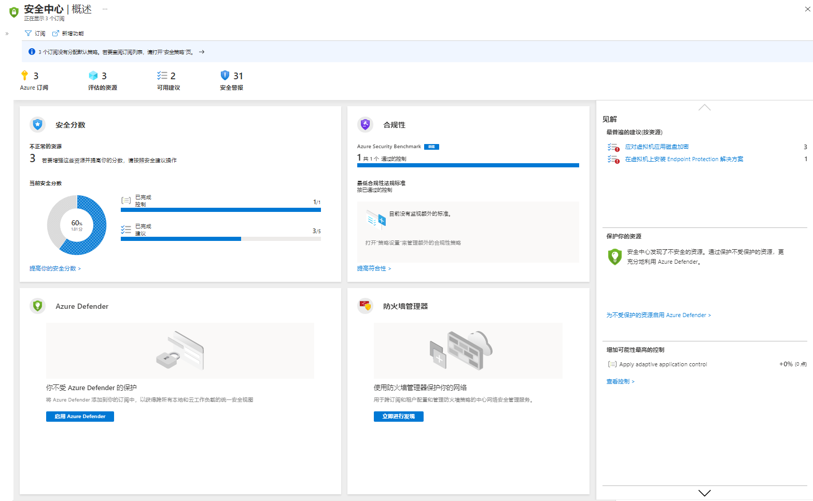

# 迷你实验室：Azure 安全中心

Azure 安全中心为你的混合云工作负载提供统一的安全管理和威胁防护。若要在 Azure 订阅中启用安全中心，请遵循以下步骤：

1. 登录到 [Azure 门户](https://portal.azure.com)。

1. 从门户的菜单中，选择 **“安全中心”**。 

    此时会打开安全中心的“概述”页面。

    

**“安全中心 - 概述”** 提供统一的视图用于查看混合云工作负荷的安全状况，可让你发现和评估工作负荷的安全性，以及识别和缓解风险。安全中心会自动免费启用以前尚未由你或其他订阅用户加入的所有 Azure 订阅。

在首次启动安全中心后的几分钟内，可以看到：

- 有关如何改善已连接资源的安全性的“见解建议”。
- 已设置优先顺序的安全警报以及快速调查问题和修复攻击所需的信息
- 当前正在由安全中心评估的资源的清单，以及每个资源的安全状况。
- 对订阅安全状况的安全功能分数衡量

> **提示：** 若要在管理组中的所有订阅上启用安全中心，请参阅[在多个 Azure 订阅上启用安全中心](https://docs.microsoft.com/zh-cn/azure/security-center/onboard-management-group)。
