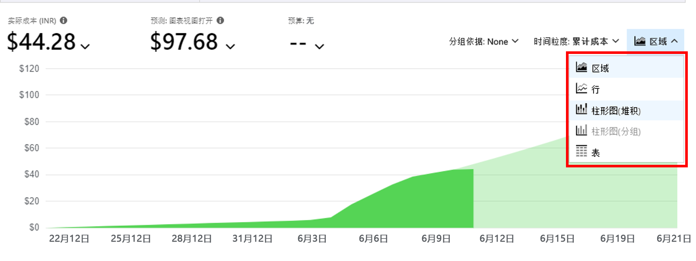
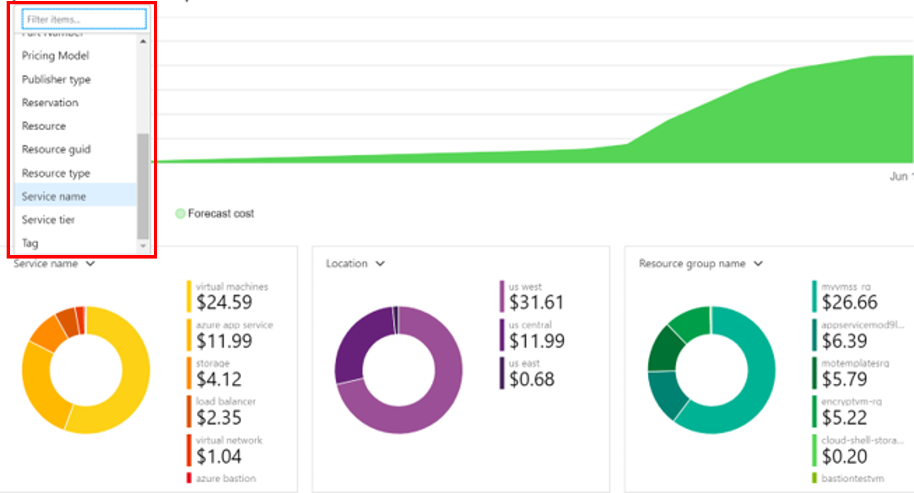

# 迷你实验室：使用 Azure Monitor 监视成本

对于本小型实验室，必须在计费周期内存在先前运行和当前运行的服务。如果自资源部署以来不到 24 小时，则数据可能不可用。

## 导航到成本分析

1. 登录至 Azure 门户，网址：[https://portal.azure.com](https://portal.azure.com/)

1. 搜索 **“成本管理”**，然后从结果列表中选择 **“成本管理 + 账单”**。

1. 在 **“成本管理”** 下，选择并查看 **“成本分析”** 
> 请注意，这类似于 **“成本管理 + 账单概述”**。

## 自定义报告

1. 自定义显示，以显示实际成本和预测成本。更改粒度并选择 **“区域”** 以更改图表类型。

    
    
1. 对于其他图表（例如 **“服务名称”**、 **“位置”** 和 **“资源组名称”** ），请在这些图表上使用筛选器来显示不同数据的结果。

    
