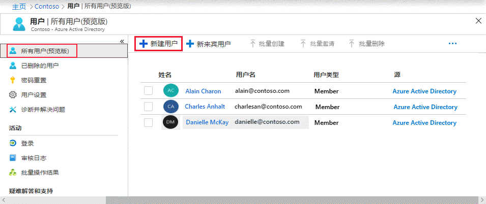

# 迷你实验室：使用 Azure Active Directory 添加用户

在 Azure Active Directory (Azure AD) 组织中添加新用户或从中删除现有用户。要添加或删除用户，必须是用户管理员或全局管理员。

可以使用 Azure Active Directory 门户创建新用户。请按照以下步骤进行操作：

1.	以组织的用户管理员身份登录到 Azure 门户 ([https://portal.azure.com](https://portal.azure.com/))。

2.	在任何页面中搜索并选择 *“Azure Active Directory”*。

3.	选择 **“用户”**，然后选择 **“新用户”**。

    

4.	在 **“用户”** 页面上，输入此用户的信息：

    - **名称**。必填。新用户的名字和姓氏。例如 *TesterAAD*。

    - **用户名**。必填。新用户的用户名。例如 *TesterAAD@contoso.com*。用户名的域部分必须使用初始默认域名 *<yourdomainname>.onmicrosoft.com*，或者自定义域名，例如 *contoso.com*。

    - **作业信息**： 你可以在此处添加有关用户的更多信息，或者以后再添加。有关添加用户信息的更多信息，请参阅[如何添加或更改用户个人资料信息](https://docs.microsoft.com/zh-cn/azure/active-directory/fundamentals/active-directory-users-profile-azure-portal)。

5.	复制 **“密码”** 框中提供的自动生成的密码。你需要将此密码提供给用户，以进行初次登录。

6.	选择 **“创建”**。

用户已创建并添加到你的 Azure AD 组织中。
