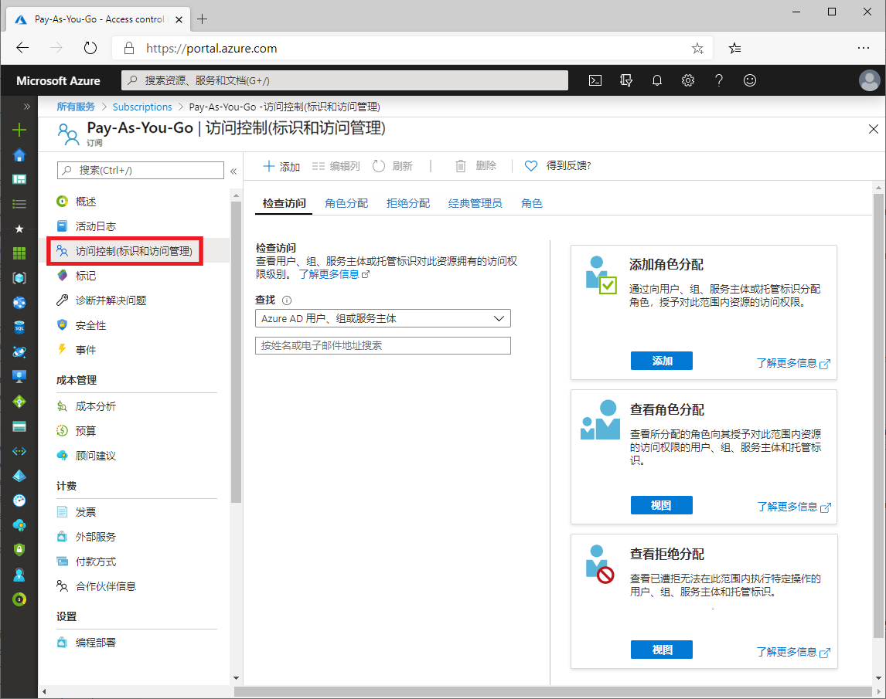
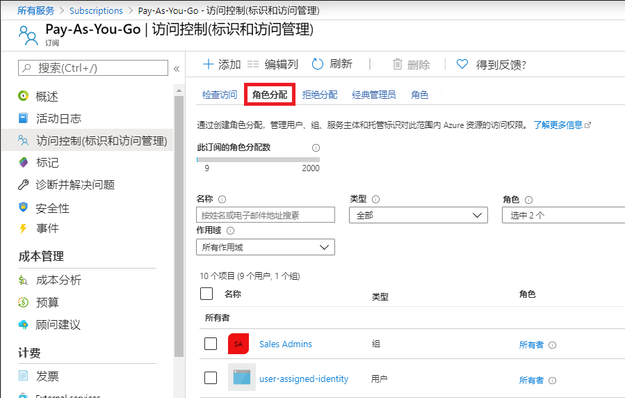
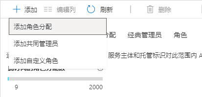
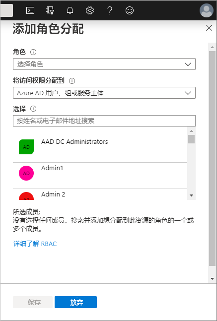
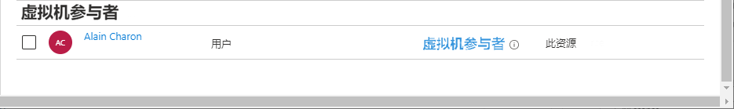

# 迷你实验室：添加 Azure 角色分配 

## 前提条件

要添加或删除角色分配，必须具有：

* ```Microsoft.Authorization/roleAssignments/write``` 和 ```Microsoft.Authorization/roleAssignments/delete``` 权限，例如*用户访问管理员*或*所有者*。


**访问控制 (IAM)** 是用于分配角色以授予对 Azure 资源的访问权限的边栏选项卡。它也称为标识和访问管理，出现在 Azure 门户的多个位置。以下是一个订阅的“访问控制(IAM)”边栏选项卡的示例。



为了最有效地使用“访问控制(IAM)”边栏选项卡，如果在尝试分配角色时可以回答以下三个问题，那么它会有所帮助：

**1. 谁需要访问权限？**

这是指用户、组、服务主体或托管标识。这也称为 *“安全主体”*。

**2. 他们需要什么角色？**

权限被分组为角色。可以从几个[内置]角色列表中进行选择，也可以使用自己的自定义角色。

**3. 他们需要访问哪里？**

哪里指的是访问权限适用的资源集。它可以是管理组、订阅、资源组或单个资源（例如存储帐户）。这称为*范围*。

## 添加角色分配

在 Azure RBAC 中，若要授予对 Azure 资源的访问权限，请添加角色分配。请按照以下步骤分配角色。

1. 在 Azure 门户中，单击 **“所有服务”**，然后选择要授予访问权限的范围。 

2. 单击该范围的特定资源。

3. 选择 **“访问控制 (IAM)”**。

4. 单击 **“角色分配”** 选项卡以查看该范围内的角色分配。



5. 单击 **“添加”** > **“添加角色分配”**。

如果没有分配角色的权限，则 **“添加角色分配”** 选项将被禁用。



将打开 **“添加角色分配”** 窗格。



6. 在 **“角色”** 下拉列表中，选择一个角色，例如 **“虚拟机参与者”**。

7. 在 **“选择”** 列表中，选择一个用户、组、服务主体或托管标识。如果在列表中没有看到安全主体，则可在 **“选择”** 框中键入信息，以在目录中搜索显示名称、电子邮件地址和对象标识符。

8. 单击 **“保存”** 以分配角色。

片刻之后，将在所选范围内为安全主体分配角色。



 
