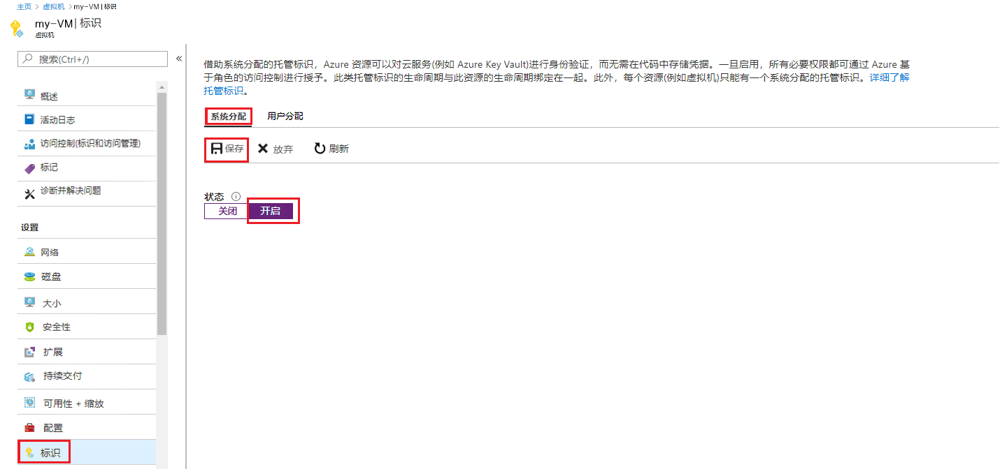

# 迷你实验室：在现有 VM 上启用系统分配托管标识

## 启用托管标识

要在最初未预配系统分配的托管标识的 VM 上启用该托管标识，你的帐户需要[虚拟机参与者](https://docs.microsoft.com/zh-cn/azure/role-based-access-control/built-in-roles#virtual-machine-contributor)角色分配。无需进行额外 Azure AD 目录角色分配。

1. 使用与包含 VM 的 Azure 订阅相关联的帐户登录 Azure 门户：[https://portal.azure.com](https://portal.azure.com/)。

2. 导航到所需的虚拟机，然后选择 **“标识”**。

3. 在 **“系统分配”**、 **“状态”** 下，选择 **“开”**，然后单击 **“保存”**。

     

## 使用托管标识 (PowerShell) 登录 Azure VM

传统上，若要使用自身的标识访问受保护资源，脚本客户端需要：

- 作为机密/Web 客户端应用程序注册 Azure AD 并获准。

- 使用应用凭据（可能嵌入在脚本中）通过其服务主体登录。

凭借 Azure 资源的托管标识，脚本客户端无需再执行这两种操作，因为它可以通过 Azure 资源服务主体的托管标识进行登录。

以下脚本演示如何：

1. 使用 VM 的 Azure 资源服务主体的托管标识登录 Azure AD。  

2. 调用 Azure 资源管理器 cmdlet 获取有关 VM 的信息。PowerShell 负责自动管理令牌的使用。  

   ```azurepowershell
   Add-AzAccount -identity

   # Call Azure Resource Manager to get the service principal ID for the VM's managed identity for Azure resources. 
   $vmInfoPs = Get-AzVM -ResourceGroupName <RESOURCE-GROUP> -Name <VM-NAME>
   $spID = $vmInfoPs.Identity.PrincipalId
   echo "The managed identity for Azure resources service principal ID is $spID"
   ```
