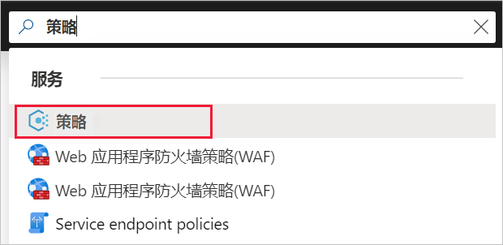
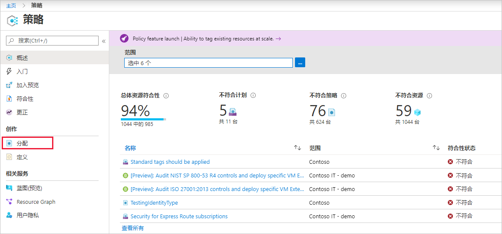
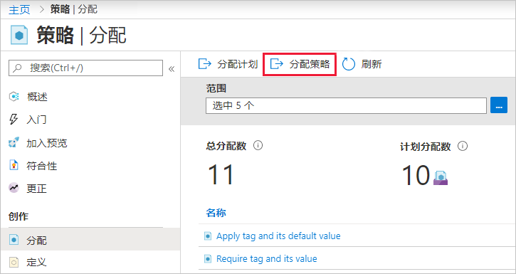
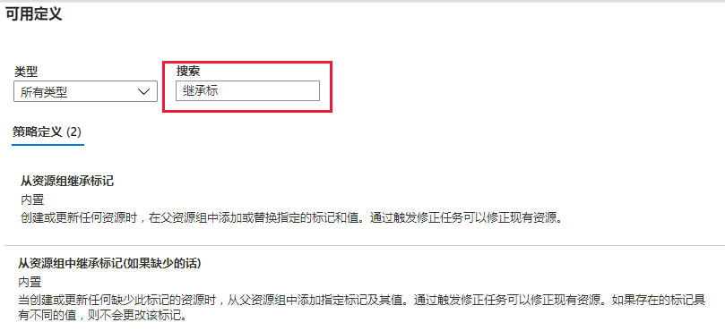

# 迷你实验室：创建和管理策略以强制实施合规性

在本小型实验室中，你将学习使用 Azure Policy 完成一些更常见的与整个组织中创建、分配和管理策略相关的任务，例如：

* 分配策略以强制实施你将来要创建的资源条件

* 创建并分配计划定义以跟踪多个资源的合规性

* 解决不合规或被拒绝的资源

* 在整个组织中实施新策略

## 分配策略

强制遵守 Azure 策略的第一步是分配策略定义。策略定义确定了在哪些条件下强制执行策略以及有哪些效果。在本例中，分配名为 *“如果缺少，则从资源组继承标记”* 的内置策略定义，以将指定的标记及其值从父资源组添加到缺少该标记的新资源或更新的资源。

1. 前往 Azure 门户以分配策略。搜索并选择 **“策略”**。

2. 在 Azure Policy 页面的左侧选择 **“分配”**。分配是将策略分配到特定范围。

3. 在 **“策略 - 分配”** 页面的顶部，选择 **“分配策略”**。

4. 在 **“分配策略”** 页面和 **“基本信息”** 选项卡上，通过选择省略号并选择管理组或订阅，选择 **“范围”**。我们选择一个资源组。范围确定要强制执行策略分配的资源或资源组。然后在 **“范围”** 页的底部选择 **“选择”**。

5. 可基于“范围”排除资源。排除从低于 **“范围”** 级别的一个级别开始。 **“排除资源”** 是可选的，因此暂时将其留空。

6. 选择 **“策略定义”** 省略号，打开可用定义的列表。可以使用 *“内置”* 来筛选策略定义**的类型**，以查看所有相关策略定义及其说明。

7. 选择 **“从资源组中继承标记(如果缺少的话)”**。找到并选择策略定义后，选择 来筛选策略定义的类型 **“可用定义”** 页底部的 **“选择”**。

8. **“分配名”** 会自动以你选择的策略名填充，但是你可以对其进行更改。对于本例，请保留 *“如果缺少，则从资源组继承标记”*。你还可以添加可选 **“描述”**。该描述提供有关此策略分配的详细信息。

9. 让 **“策略强制”** 保持 *“启用”* 状态。设为 *“禁用”* 时，此设置允许测试策略的结果，而不触发效果。 

10. 系统会根据登录的用户自动填充 **“分配者”**。 

11. 选择向导顶部的 **“参数”** 选项卡。

12. 对于 **“标记名称”**，请输入 *“环境”*。

13. 选择向导顶部的 **“修正”** 选项卡。

14. 让 **“创建修正任务”** 处于未选中状态。使用此框可以创建一个任务来更改现有资源以及新资源或更新的资源。 

15. 系统会自动勾选 **“创建托管标识”**，因为此策略定义使用 modify 效果。系统会根据策略定义自动将 **“权限”** 设置为 *“参与者”*。 

16. 选择向导顶部的 **“查看 + 创建”**选项卡。

17. 查看选项，然后在页面底部选择 **“创建”**。
