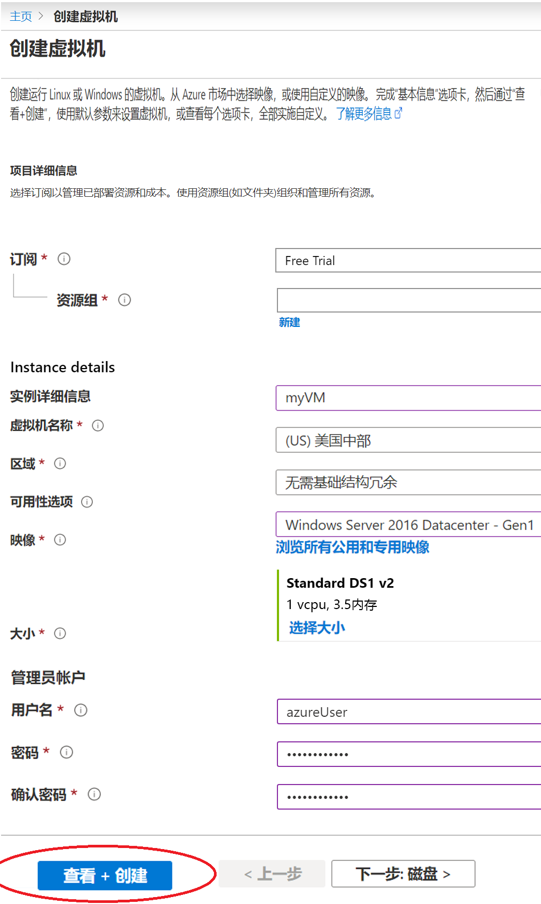
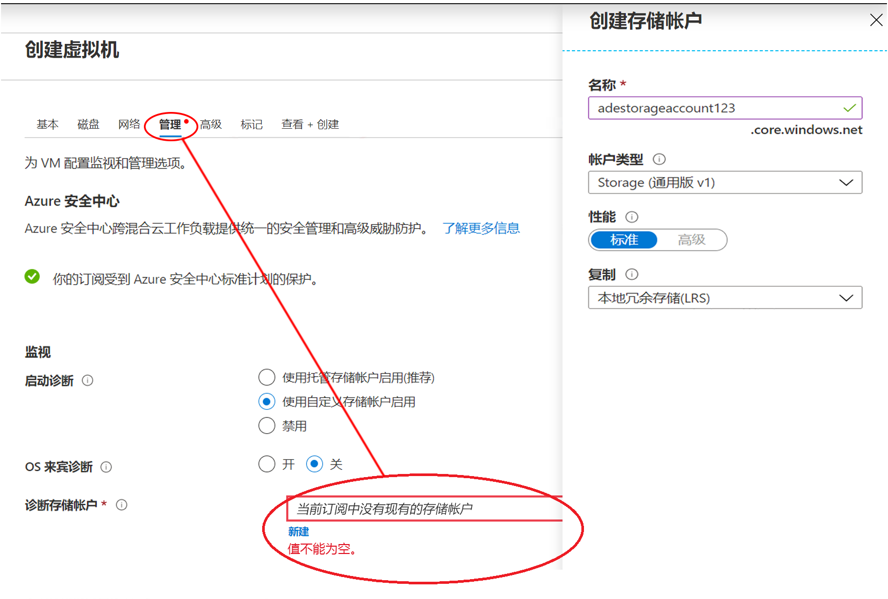
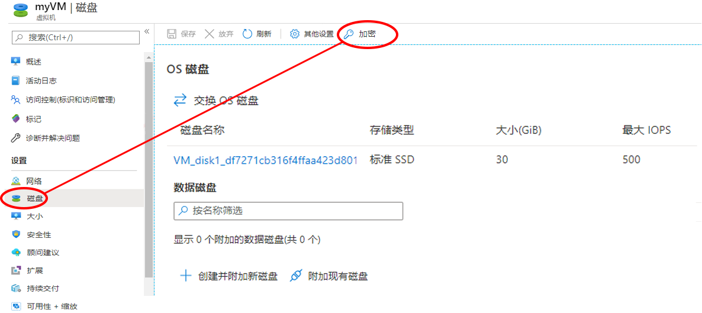
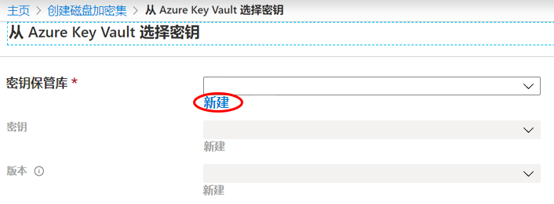
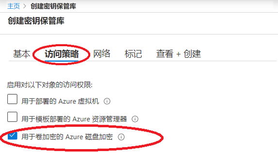

# 迷你实验室：利用 Azure 门户创建并加密 Windows 虚拟机

可以通过 Azure 门户创建 Azure 虚拟机 (VM)。Azure 门户是基于浏览器的用户界面，用于创建 VM 及其相关资源。在这个小型实验室中，你将使用 Azure 门户部署运行 Ubuntu 18.04 LTS 的 Windows 虚拟机 (VM)，创建用于存储加密密钥的密钥保管库，并对 VM 进行加密。

如果你没有 Azure 订阅，请在开始之前创建[免费帐户](https://azure.microsoft.com/free/?WT.mc_id=A261C142F)。

## 创建虚拟机

1. 登录至 Azure 门户，网址：[https://portal.azure.com](https://portal.azure.com/)
1. 在 Azure 门户网站的左上角选择 **创建资源**。
1. 在“新建”页面中，在“常用”下，选择 **“Windows Server 2016 Datacenter”**。
1. 在 **“基本信息”** 选项卡中，在**项目详细**信息下，确保选择了正确的订阅，然后选择 **“新建资源组”**。输入 *myResourceGroup* 作为名称。
1. 在 **“虚拟机名称”** 处输入 *MyVM*。
1. 对于**地区**，选择你所在地区（例如*美国东部*）。
1. 确保 **“大小”** 为 *“标准 D2s v3”*。
1. 在 **“管理员帐户”** 下，选择 **“密码”**。输入用户名和密码。

    
    
    >:警告： **警告：** **“磁盘”** 选项卡在其 **“磁盘”** 选项下有 **“加密类型”** 字段。此字段用于指定托管磁盘 + CMK 的加密选项，而不是 Azure 磁盘加密的加密选项。为避免混淆，我们建议在完成本教程的过程中完全跳过 **“磁盘”** 选项卡。

1. 选择 **“管理”** 选项卡，并验证是否具有诊断存储帐户。如果没有存储帐户，请选择 **“新建”**，为新建帐户命名，然后选择 **“确定”**

    

1. 选择 **“查看 + 创建”**。
1. 在**创建一个虚拟机**页面上，你可以看到有关将要创建的 VM 的详细信息。准备好后，选择 **创建**。

可能需要几分钟时间才能部署 VM。部署完成后，请转到下一部分。

## 加密虚拟机

>:警告： **警告：** 为了确保加密机密不会跨越区域边界，Azure 磁盘加密需要将密钥保管库和 VM 共同归置在同一区域中。创建并使用与要加密的 VM 位于同一区域的密钥保管库。 

1. VM 部署完成后，选择 **“转到资源”**。
1. 在左侧边栏中，选择 **“磁盘”**。
1. 在“磁盘”屏幕上，选择 **“加密”**。 

    

1. 在加密屏幕上，在 **“要加密的磁盘”** 下，选择 **“OS 和数据磁盘”**。
1. 在 **“加密设置”**下，选择 **“选择密钥保管库和加密密钥”**。
1. 在 **“从 Azure 密钥保管库中选择密钥”** 屏幕上，选择 **“新建”**。

    

1. 在 **“创建密钥保管库”** 屏幕上，确保资源组与用于创建 VM 的资源组相同。
1. 为密钥保管库命名。Azure 上的每个密钥保管库都必须具有唯一的名称。
1. 在 **“访问策略”** 选项卡中，选中 **“用于卷加密的 Azure 磁盘加密”** 复选框。

    

1. 选择 **“查看 + 创建”**。  
1. 密钥保管库通过验证后，选择 **“创建”**。这将返回 **“从 Azure 密钥保管库选择密钥”** 屏幕。
1. 将 **“密钥”** 字段留空，然后选择 **“选择”**。
1. 在加密屏幕的顶部，选择 **“保存”**。弹出窗口警告你虚拟机将重新启动。选择 **“是”**。

## 清理资源

不再需要时，可以删除资源组、虚拟机和所有相关资源。为此，请选择虚拟机的资源组，选择 **“删除”**，然后确认要删除的资源组的名称。
